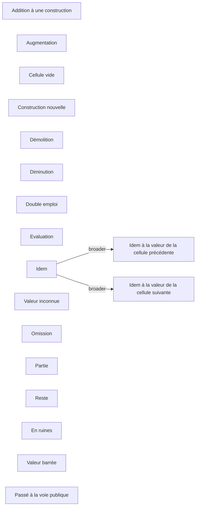

# Schemas related to the "Land registry document use" modelet

## Taxonomy
### Special values in tables, mostly in "Tiré de" et "Porté à" columns
* ```https://w3id.org/tabulae#SpecialCellValuesList```
