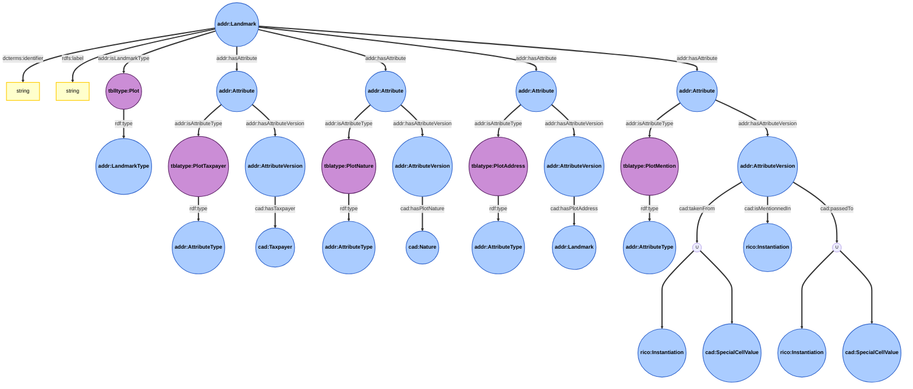
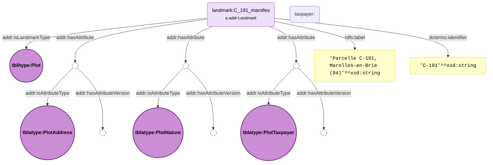
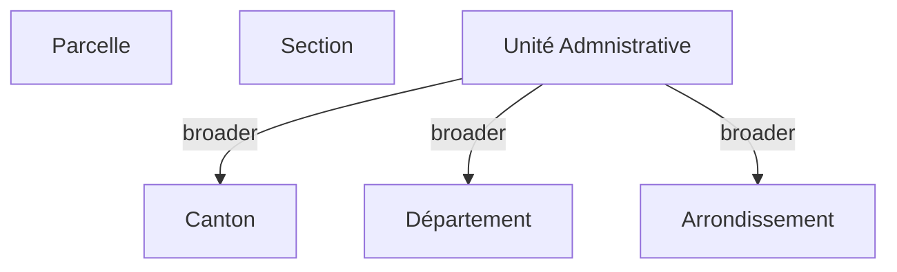
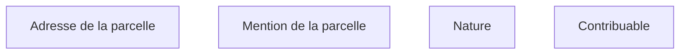

# Illustrated documentation of the Land Registry Landmarks extension

This page provides an illustrated representation of the Land Registry extension of the ```Addresses``` submodule of the PeGazUs ontology. Please refer to the ontology itself to obtain the full definitions for each property.

## Ontology
### Plot description
*Example based on a ```Plot``` landmark, illustrating how land plots are extended.
Core attributes are documented in the ```Addresses``` submodule of the core ontology.
Temporal evolution details (changes and events) can be found in the core PeGazUs ontology (```Temporal evolution``` submodule).*

#### Legend
* Classes are represented by blue circles.
* Instances are represented by purple circles.
* Literals are represented by yellow rectangles.

### Plot relations with other landmarks

```mermaid
graph

```

### Note
* ```rdfs:label``` can be used to provide a human-readable, full label for the plot (e.g., including the identifier and commune name).
* ```dcterms:identifier``` is used to provide the plot identifier.
* In practice, instances of ```cad:Nature``` are defined within the ```cad:NatureList``` SKOS concept scheme.
* In practice, instances of ```cad:SpecialCellValue``` are defined within the ```cad:SpecialCellValuesList``` SKOS concept scheme.
* ```tblatype:PlotMention``` attribute is connected to the submodule related to the use of land registry documents.

## Example


## Taxonomies
### Land registry landmark types
* URI : ```https://w3id.org/tabulae#LandRegistryLandmarkList```

### Land registry attributes types
* URI : ```https://w3id.org/tabulae#LandRegistryAttributeList```

### Plot natures
* URI : ```https://w3id.org/tabulae#NatureList```

```mermaid
graph LR
    %% Déclaration des concepts uniques
    Abreuvoir["Abreuvoir"]
    NatureNonBatie["Type de nature non bâtie"]
    Abricotier["Plantation d'abricotiers"]
    Plantation["Plantation"]
    Acacia["Plantation d'acacias"]
    Ajonc["Ajonc"]
    Allee["Allée"]
    Amandier["Plantation d'amandiers"]
    Appenti["Appenti"]
    NatureBatie["Type de nature bâtie"]
    Batiment["Bâtiment"]
    Ardoisiere["Ardoisière"]
    Carriere["Carrière"]
    Argilliere["Argillière"]
    Asperges["Plantation d'asperges"]
    Atelier["Atelier"]
    Aulnaie["Aulnaie"]
    Barraque["Baraque"]
    Bassin["Bassin"]
    BatimentRural["Bâtiment rural"]
    Batterie["Batterie"]
    Bief["Bief"]
    BoisAgrement["Bois d'agrément"]
    ObjetDAgrement["Objet d'agrément"]
    Bois["Bois"]
    Broussaille["Brousaille"]
    Bruyere["Bruyère"]
    Buissiere["Buissières"]
    CanalAgrement["Canal d'agrément"]
    Canal["Canal"]
    Cassis["Plantation de cassis"]
    Cedratiers["Plantation de cédratier"]
    Cerisaies["Cerisaies"]
    Chantier["Chantier"]
    Charmille["Charmille"]
    Chataigneraie["Châtaigneraies"]
    Chemin["Chemin"]
    ChemindeFer["Chemin de fer"]
    Cheneviere["Chenevière"]
    Cimetiere["Cimetiere"]
    Citronnier["Plantation de citronnier"]
    Clos["Clos"]
    CourCommune["Cour commune"]
    Cour["Cour"]
    CoursDEau["Cours d'eau"]
    Courtil["Courtil"]
    Jardin["Jardin"]
    Crayere["Crayère"]
    Cressonniere["Cressonnière"]
    Cuisine["Cuisine"]
    Dependance["Dépendance"]
    Digue["Digue"]
    Douve["Douve"]
    Dune["Dune"]
    Eau["Eau"]
    Ecluse["Ecluse"]
    Ecurie["Ecurie"]
    Eglise["Eglise"]
    EtablissementDeBains["Etablissement de bains"]
    EtangEmpoissonne["Etang empoissonné"]
    Etang["Etang"]
    Falaise["Falaise"]
    Figuier["Plantation de figuiers"]
    Fleur["Fleurs"]
    Fontaine["Fontaine"]
    Fosse["Fossé"]
    Fougeraie["Fougeraie"]
    Fraisier["Fraisiers"]
    Framboisier["Framboisiers"]
    Friche["Friche"]
    Genet["Genêt"]
    Graviere["Gravière"]
    Groseillier["Groseillier"]
    Gue["Gué"]
    Hangar["Hangar"]
    Herbage["Herbage"]
    Houblonniere["Houblonnière"]
    JardinDAgrement["Jardin d'agrément"]
    JardinMaraicher["Jardin Maraîcher"]
    Potager["Potager"]
    JardinMarais["Jardin Marais"]
    Jonc["Jonc"]
    Lac["Lac"]
    Lagune["Lagune"]
    Lande["Lande"]
    Lavande["Lavande"]
    Lavoir["Lavoir"]
    MachineAVapeur["Machine à vapeur"]
    Magasin["Magasin"]
    Maison["Maison"]
    Manufacture["Manufacture"]
    Fabrique["Fabrique"]
    MaraisSalant["Marais salant"]
    Mare["Mare"]
    Marecage["Marécage"]
    Marniere["Manière"]
    Meloniere["Melonière"]
    Mine["Mine"]
    Miniere["Minière"]
    MoulinAEau["Moulin à eau"]
    Moulin["Moulin"]
    MoulinAVent["Moulin à vent"]
    Murier["Plantation de mûriers"]
    Noisetier["Plantation de noisetiers"]
    Noyer["Plantation de noyers"]
    Olivier["Plantation d'oliviers"]
    Oranger["Plantation d'orangers"]
    Ormaie["Ormaie"]
    Oseraie["Oseraie"]
    Parterre["Parterre"]
    Passage["Passage"]
    Pecher["Plantation de pêchers"]
    Pepiniere["Pépinière"]
    Peuplier["Peuplier"]
    PieceDEauAgrement["Pièce d'eau d'agrément"]
    PieceDEau["Pièce d'eau"]
    Pin["Pin"]
    Plage["Plage"]
    Platriere["Plâtrière"]
    Poirier["Plantation de poiriers"]
    Verger["Verger"]
    Pommeraie["Pommeraie"]
    Poudriere["Poudrière"]
    Pre["Pre"]
    PrePlante["Pré planté"]
    Reservoir["Réservoir"]
    Rigole["Rigole"]
    Riziere["Rizière"]
    Rocher["Rocher"]
    Rosier["Rosier"]
    Routoir["Routoir"]
    Ruine["Ruine"]
    Sabliere["Sablière"]
    Salin["Salin"]
    Sapin["Sapin"]
    Saulaie["Saulaie"]
    Serre["Serre"]
    Sol["Sol"]
    Terrain["Terrain"]
    TerrainABatir["Terrain à bâtir"]
    TerrainDAgregemnt["Terrain d'agrément"]
    Terre["Terre"]
    TerreAVigne["Terre à vigne"]
    TerreLabourable["Terre labourable"]
    TerrePlantee["Terre plantée"]
    TerreVaine["Terre vaine"]
    Tourbiere["Tourbière"]
    Truffiere["Truffière"]
    Vigne["Vigne"]
    Vivier["Vivier"]
    Etendoir["Etendoir"]
    Sechoir["Séchoir"]
    Four["Four"]
    Fournil["Fournil"]
    Marais["Marais"]
    Palus["Palus"]
    Patis["Pâtis"]
    Paturage["Pâturage"]
    Pature["Pâture"]

    %% Déclaration des relations
    Patis -.->|closeMatch| Pature
    Argilliere -.->|closeMatch| Carriere
    NatureNonBatie -->|broader| TerreLabourable
    NatureBatie -->|broader| EtablissementDeBains
    PieceDEau -->|broader| PieceDEauAgrement
    NatureBatie -->|broader| Cuisine
    NatureNonBatie -->|broader| Bois
    Plantation -->|broader| Olivier
    NatureNonBatie -->|broader| Meloniere
    NatureNonBatie -->|broader| Rosier
    Batiment -->|broader| Poudriere
    NatureNonBatie -->|broader| Reservoir
    Palus -.->|closeMatch| Marais
    NatureNonBatie -->|broader| Bassin
    NatureNonBatie -->|broader| Chantier
    Batiment -->|broader| Batterie
    NatureBatie -->|broader| Cimetiere
    NatureNonBatie -->|broader| Rocher
    Ardoisiere -.->|closeMatch| Carriere
    Plantation -->|broader| Pommeraie
    NatureBatie -->|broader| Eglise
    NatureNonBatie -->|broader| TerreAVigne
    NatureNonBatie -->|broader| Jardin
    NatureNonBatie -->|broader| Palus
    Batiment -->|broader| BatimentRural
    Pature -.->|closeMatch| Paturage
    ObjetDAgrement -->|broader| CanalAgrement
    Pommeraie -.->|closeMatch| Verger
    ObjetDAgrement -->|broader| TerrainDAgregemnt
    NatureBatie -->|broader| Lavoir
    NatureNonBatie -->|broader| TerrainABatir
    JardinMaraicher -.->|exactMatch| Potager
    NatureNonBatie -->|broader| Carriere
    Plantation -->|broader| Groseillier
    NatureNonBatie -->|broader| Ormaie
    Cour -->|broader| CourCommune
    NatureNonBatie -->|broader| Chataigneraie
    NatureNonBatie -->|broader| Allee
    Plantation -->|broader| Abricotier
    NatureNonBatie -->|broader| Courtil
    NatureNonBatie -->|broader| Graviere
    NatureNonBatie -->|broader| Salin
    Plantation -->|broader| Acacia
    NatureNonBatie -->|broader| Lande
    NatureNonBatie -->|broader| Fontaine
    NatureNonBatie -->|broader| Saulaie
    Magasin -.->|closeMatch| Batiment
    NatureNonBatie -->|broader| Aulnaie
    Fournil -.->|closeMatch| Four
    NatureNonBatie -->|broader| Digue
    NatureNonBatie -->|broader| Broussaille
    NatureNonBatie -->|broader| Ardoisiere
    NatureNonBatie -->|broader| Buissiere
    NatureNonBatie -->|broader| Friche
    NatureNonBatie -->|broader| Fraisier
    NatureBatie -->|broader| Barraque
    Plantation -->|broader| Amandier
    NatureNonBatie -->|broader| Chemin
    ObjetDAgrement -->|broader| BoisAgrement
    NatureNonBatie -->|broader| TerreVaine
    NatureNonBatie -->|broader| Passage
    NatureNonBatie -->|broader| Platriere
    NatureNonBatie -->|broader| Vigne
    NatureNonBatie -->|broader| Sabliere
    Paturage -.->|closeMatch| Patis
    NatureNonBatie -->|broader| Crayere
    NatureBatie -->|broader| Ecurie
    Etang -->|broader| EtangEmpoissonne
    Plantation -->|broader| Figuier
    NatureNonBatie -->|broader| Patis
    Batiment -->|broader| Ruine
    NatureBatie -->|broader| Atelier
    ObjetDAgrement -->|broader| PieceDEauAgrement
    Four -.->|closeMatch| Fournil
    NatureNonBatie -->|broader| Cheneviere
    NatureNonBatie -->|broader| CoursDEau
    Moulin -->|broader| MoulinAVent
    NatureNonBatie -->|broader| Plantation
    NatureNonBatie -->|broader| Argilliere
    NatureNonBatie -->|broader| TerrePlantee
    Plantation -->|broader| Oranger
    Hangar -.->|closeMatch| Batiment
    NatureBatie -->|broader| Fournil
    Plantation -->|broader| Citronnier
    Plantation -->|broader| Murier
    NatureNonBatie -->|broader| Eau
    Bois -->|broader| BoisAgrement
    NatureNonBatie -->|broader| Lac
    NatureNonBatie -->|broader| Peuplier
    NatureNonBatie -->|broader| Miniere
    NatureBatie -->|broader| Etendoir
    Sechoir -.->|closeMatch| Etendoir
    Jardin -->|broader| JardinMaraicher
    NatureNonBatie -->|broader| Vivier
    NatureNonBatie -->|broader| Plage
    NatureNonBatie -->|broader| Etang
    NatureBatie -->|broader| Manufacture
    NatureBatie -->|broader| Fabrique
    NatureNonBatie -->|broader| Abreuvoir
    NatureNonBatie -->|broader| Falaise
    NatureNonBatie -->|broader| Douve
    NatureBatie -->|broader| Sechoir
    NatureNonBatie -->|broader| Pin
    NatureNonBatie -->|broader| Fosse
    Etendoir -.->|closeMatch| Sechoir
    NatureNonBatie -->|broader| Verger
    Moulin -->|broader| MoulinAEau
    NatureNonBatie -->|broader| Ecluse
    NatureNonBatie -->|broader| Lavande
    NatureNonBatie -->|broader| Mine
    NatureNonBatie -->|broader| Charmille
    NatureBatie -->|broader| Serre
    Marais -.->|closeMatch| Palus
    Canal -->|broader| CanalAgrement
    ObjetDAgrement -->|broader| JardinDAgrement
    Plantation -->|broader| Poirier
    NatureNonBatie -->|broader| Lagune
    Plantation -->|broader| Cerisaies
    NatureNonBatie -->|broader| Genet
    NatureNonBatie -->|broader| Pature
    NatureNonBatie -->|broader| Riziere
    Jardin -->|broader| Potager
    Poirier -.->|closeMatch| Verger
    NatureBatie -->|broader| Appenti
    NatureNonBatie -->|broader| Bruyere
    NatureBatie -->|broader| Cour
    TerrePlantee -.->|closeMatch| Plantation
    Plantation -.->|closeMatch| TerrePlantee
    Paturage -.->|closeMatch| Pature
    NatureNonBatie -->|broader| Clos
    Manufacture -.->|closeMatch| Fabrique
    NatureNonBatie -->|broader| Canal
    NatureNonBatie -->|broader| Gue
    NatureNonBatie -->|broader| Oseraie
    NatureNonBatie -->|broader| Pepiniere
    NatureNonBatie -->|broader| Terre
    NatureNonBatie -->|broader| Sapin
    NatureNonBatie -->|broader| Truffiere
    NatureNonBatie -->|broader| Cressonniere
    Dependance -.->|closeMatch| Batiment
    NatureBatie -->|broader| Dependance
    NatureNonBatie -->|broader| MaraisSalant
    Plantation -->|broader| Pecher
    Plantation -->|broader| Fleur
    NatureNonBatie -->|broader| Herbage
    NatureBatie -->|broader| MachineAVapeur
    NatureNonBatie -->|broader| Marecage
    NatureNonBatie -->|broader| ChemindeFer
    Plantation -->|broader| Cedratiers
    Barraque -.->|closeMatch| Batiment
    NatureNonBatie -->|broader| Parterre
    CanalAgrement -.->|closeMatch| Canal
    Pature -.->|closeMatch| Patis
    NatureNonBatie -->|broader| Framboisier
    NatureNonBatie -->|broader| Jonc
    NatureNonBatie -->|broader| PrePlante
    Courtil -.->|closeMatch| Jardin
    NatureBatie -->|broader| Batiment
    NatureBatie -->|broader| Maison
    Patis -.->|closeMatch| Paturage
    NatureNonBatie -->|broader| TerrainDAgregemnt
    NatureNonBatie -->|broader| Terrain
    NatureNonBatie -->|broader| Marniere
    NatureNonBatie -->|broader| PieceDEau
    NatureNonBatie -->|broader| Mare
    NatureNonBatie -->|broader| Tourbiere
    Appenti -.->|closeMatch| Batiment
    JardinMaraicher -.->|closeMatch| Plantation
    BoisAgrement -.->|closeMatch| Bois
    NatureNonBatie -->|broader| Ajonc
    NatureNonBatie -->|broader| Fougeraie
    NatureBatie -->|broader| Moulin
    NatureNonBatie -->|broader| Dune
    Jardin -->|broader| JardinDAgrement
    NatureNonBatie -->|broader| Sol
    NatureNonBatie -->|broader| Marais
    Plantation -->|broader| Cassis
    Plantation -->|broader| Noisetier
    NatureNonBatie -->|broader| Pre
    NatureBatie -->|broader| Hangar
    NatureNonBatie -->|broader| Bief
    NatureNonBatie -->|broader| Paturage
    NatureNonBatie -->|broader| Rigole
    Jardin -->|broader| JardinMarais
    NatureBatie -->|broader| Magasin
    Plantation -->|broader| Asperges
    NatureBatie -->|broader| Four
    Plantation -->|broader| Noyer
    NatureNonBatie -->|broader| Routoir
    NatureNonBatie -->|broader| Houblonniere
```
