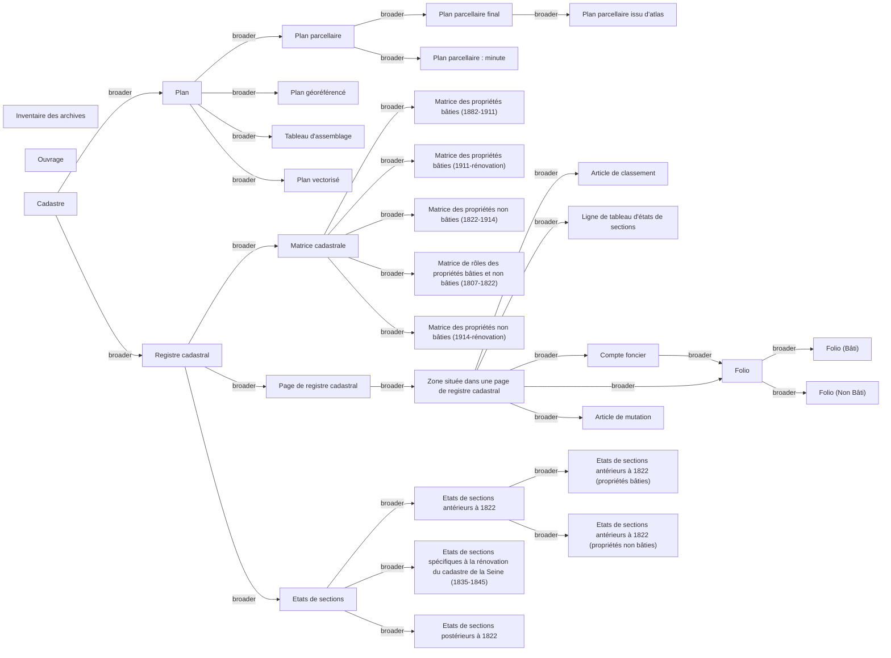

# Sources 
This page includes additionnal documentation of the ```Sources``` modelet. it includes examples.

## Representation of the source documents and their derived content

```mermaid
graph 
    %% 1. Nodes
    LRConceptNode("Cadastre (corpus)<br><small>a rico:RecordSet</small>")
    LRInstantiationNode("Cadastre (corpus) édition départementale<br><small>a rico:Instantiation</small>")

    RegisterConceptNode("Registre d'état de section de Marolles<br><small>a rico:Record</small>")
    PhysicalRegisterNode("Registre d'état de sections (physique), édition départementale<br><small>a rico:Instanciation</small>")
    ArchLocationLit["Archives départementales du Val-de-Marne"^^xsd:string]
    PubDate["1810"^^xsd:date]
    ArchivalReferenceLit["3P 387"^^xsd:string]
    DigitisedRegisterNode("Registre numérisé<br><small>a rico:Instanciation</small>")
    DigArchivalReferenceLit["FRAD094-3P-000387-01"^^xsd:string]

    ImageNode("Page de registre numérisée<br><small>a rico:Instanciation</small>")
    RefImageNode["FRAD094-3P-000387-0001"^^xsd:string]
    AnnotationClassInstBN((" "))
    tblAnnotationClass((tbl:AnnotationClass))
    SKOSPageClass(("anclass:ETSTab<br><small>a "))
    TreatedImageNode("Page de registre transcrite"<br><small>a rico:Instantiation</small>)
    TreatedImageNodeUUID["Identifiant UUID"^^xsd:literal]

    ClassificationActivity["000003<br><small>a prov:Activity</small>"]
    SoftwareAgentYolo["Modèle de classification<br><small>a prov:SoftwareAgent"]
    TranscriptionActivity01["000001<br><small>a prov:Activity</small>"]
    SoftwareAgentDAN["Modèle d'extraction d'informations<br><small>a prov:SoftwareAgent"]
    %%NERActivity["000002<br><small>a prov:Activity</small>"]
    %%SoftwareAgentCamembert["NER<br><small>a prov:SoftwareAgent"]

    RowNode("Ligne de registre<br><small> a rico:Instanciation</small>")
    LiteralFullRow["Les uselles de Marolles 60 Berthier Alexandre Prince de Neufchâtel Terre"^^xsd:string]
    IIIFImageUrlLiteral["https://archives.valdemarne.fr/_recherche-images/show/59414/image/38776/4/info.json"^^xsd:string]
    RowInteger[18^^xsd:integer]
    CoordsFullRow[1160,1103,1529,1421^^xsd:string]
    RowNodeClassBN((" "))
    RowNodeClass
    RowNodeClassValue((anclass:TableRow))
    RowIdentifier["Identifiant UUID"^^xsd:string]

    NamedEntityBN((" "))
    tblNamedEntity(("tbl:NamedEntity"))
    LiteralText["Berthier Alexandre Prince de Neufchâtel"^^xsd:string]
    LiteralStartChar["26"^^xsd:integer]
    LiteralStopChar["64"^^xsd:integer]
    SKOSEntityType(("anclass:Taxpayer"))

    %% 2. Edges
    LRConceptNode == rico:includesOrIncluded ==> RegisterConceptNode
    LRConceptNode == rico:hasInstantiation ==> LRInstantiationNode

    LRInstantiationNode == rico:physicalLocation ==> ArchLocationLit 
    RegisterConceptNode == rico:hasInstantiation ==> PhysicalRegisterNode
    LRInstantiationNode == rico:hasOrHadComponent ==> PhysicalRegisterNode
    PhysicalRegisterNode == rico:publicationDate ==> PubDate
    PhysicalRegisterNode == dcterms:identifer ==> ArchivalReferenceLit
    PhysicalRegisterNode == rico:hasDerivedInstantiation ==> DigitisedRegisterNode
    DigitisedRegisterNode == rico:hasOrHadComponent ==> ImageNode
    DigitisedRegisterNode == dcterms:identifer ==> DigArchivalReferenceLit

    ImageNode == "rico:hasOrHadDerivedInstantiation" ==> TreatedImageNode 
    TreatedImageNode == rico:hasOrHadComponent ==> RowNode
    TreatedImageNode == dcterms:identifier ==> TreatedImageNodeUUID
    ImageNode  == dcterms:identifer ==> RefImageNode
    ImageNode  == tbl:IIIFImageUrl ==> IIIFImageUrlLiteral
    ImageNode  == tbl:hasClass ==> AnnotationClassInstBN
    AnnotationClassInstBN == prov:wasGeneratedBy ==> ClassificationActivity
    ClassificationActivity == prov:wasAssociatedWith ==> SoftwareAgentYolo
    TranscriptionActivity01 == prov:used ==> ImageNode
    TranscriptionActivity01 == prov:wasAssociatedWith ==> SoftwareAgentDAN
    TreatedImageNode == prov:wasGeneratedBy ==> TranscriptionActivity01
    AnnotationClassInstBN == rdf:type ==> tblAnnotationClass
    AnnotationClassInstBN == tbl:hasClassValue ==> SKOSPageClass
    
    RowNode == tbl:transcription ==> LiteralFullRow
    RowNode == tbl:xywhCoordinates ==> CoordsFullRow
    RowNode == tbl:lineOrderInArea ==> RowInteger
    RowNode == tbl:hasNamedEntity ==> NamedEntityBN
    RowNode == tbl:hasClass ==> RowNodeClassBN
    RowNode == dcterms:identifier ==> RowIdentifier
    RowNodeClassBN == tbl:hasClassValue ==> RowNodeClassValue
    
    NamedEntityBN == rdf:type ==> tblNamedEntity
    NamedEntityBN == tbl:spanValue ==> LiteralText
    NamedEntityBN == tbl:indexOfFirstCharacter ==> LiteralStartChar
    NamedEntityBN == tbl:indexOfLastCharacter ==> LiteralStopChar
    NamedEntityBN == tbl:isNamedEntityType ==> SKOSEntityType
    %%NamedEntityBN == prov:wasGeneratedBy ==> NERActivity
    %%NERActivity == prov:used ==> RowNode
    %%NERActivity == prov:wasAssociatedWith ==> SoftwareAgentCamembert

    %% 3. Apply WebVOWL Style
    classDef vowlClass fill:#aaccff,stroke:#3366cc,stroke-width:2px,color:#000,font-weight:bold;
    classDef vowlLiteral fill:#ffffcc,stroke:#ffcc00,stroke-width:2px,color:#000;
    classDef vowlInstance fill:#ece0f8,stroke:#d397d3,stroke-width:2px,color:#000;
    classDef vowlValue fill:#ffffcc,stroke:#ffcc00,stroke-width:1px,color:#000,font-family:monospace;
    %% Skos
    classDef vowlClassInstance fill:#CB8DD6,stroke:#5F2569,stroke-width:2px,color:#000,font-weight:bold;
    %% Blank node
    classDef blankNode fill:#ffffff,stroke:#888888,stroke-width:2px,stroke-dasharray: 4;

    class LRConceptNode,LRInstantiationNode,RegisterConceptNode,PhysicalRegisterNode,DigitisedRegisterNode,ImageNode,TreatedImageNode,RowNode vowlInstance;

    class ArchLocationLit,PubDate,ArchivalReferenceLit,DigArchivalReferenceLit,RefImageNode,LiteralFullRow,IIIFImageUrlLiteral,RowInteger,CoordsFullRow,TreatedImageNodeUUID,LiteralText,LiteralStartChar,LiteralStopChar,RowIdentifier vowlLiteral;

    class AnnotationClassInstBN,NamedEntityBN,RowNodeClassBN blankNode;

    class tblAnnotationClass,tblNamedEntity vowlClass;

    class SKOSPageClass,SKOSEntityType,RowNodeClass vowlClassInstance;
```

### Example of <i>états de sections</i> (Initial register)

#### Notes
* ```prov:Activity``` has additionnal properties (start date, end date).
* ```prov:Agent``` and ```prov:SoftwareAgent``` also have additionnal properties.

### Example of <i>matrice</i> (Initial register)
*To be added*

## Taxonomy
### Type of sources
* URI : ```https://w3id.org/tabulae#LandRegistrySourceList```


## References
* For provenance description :
```plaintext 
Melvin Hersent, Abadie Nathalie, Duménieu Bertrand, Perret Julien. Modèles et outils pour la publication de métadonnées d'archives géographiques et de leurs données dérivées. Humanistica 2023, Association francophone des humanités numériques, Jun 2023, Genève, Suisse. pp.hal-04110787. ⟨hal-04110787⟩
```