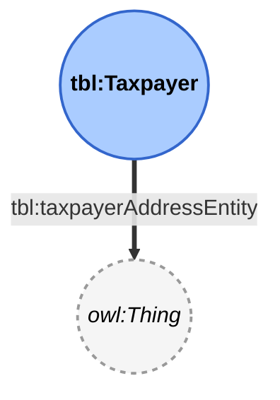
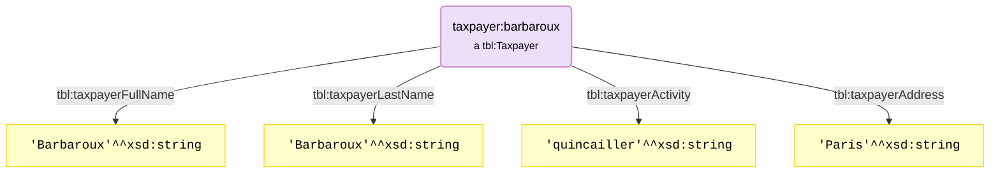
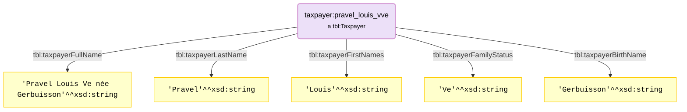

# Illustrated documentation of Taxpayers

This page proposes illustrated representation of the ```Taxpayer``` sub-module of the *PeGazUs* ontology.
Please refer to the ontology to get the full definitions of each property.

## Ontology
### Datatype properties

```mermaid
graph 
    %% 1. Nodes
    TaxpayerNode(("tbl:Taxpayer"))
    LabelLit["string"]
    NameLit["string"]
    LastNameLit["string"]
    FirstNamesLit["string"]
    BirthNameLit["string"]
    SpouseOrChildrenFirstNames["string"]
    OrganisationNameLit["string"]
    ActivityLit["string"]
    AddressLit["string"]
    FamilyStatusLit["string"]
    TitleLit["string"]

    %% 2. Connect the unique IDs
    
    TaxpayerNode == "tbl:taxpayerLabel" ==> LabelLit 
    TaxpayerNode == "tbl:taxpayerFullName" ==> NameLit 
    TaxpayerNode == "tbl:taxpayerLastName" ==> LastNameLit
    TaxpayerNode == "tbl:taxpayerFirstNames" ==> FirstNamesLit
    TaxpayerNode == "tbl:taxpayerBirthName" ==> BirthNameLit
    TaxpayerNode == "tbl:taxpayerSpouseOrChildrenFirstNames" ==> SpouseOrChildrenFirstNames
    TaxpayerNode == "tbl:taxpayerOrganisationName" ==> OrganisationNameLit
    TaxpayerNode == "tbl:taxpayerActivity" ==> ActivityLit
    TaxpayerNode == "tbl:taxpayerAddress" ==> AddressLit
    TaxpayerNode == "tbl:taxpayerFamilyStatus" ==> FamilyStatusLit
    TaxpayerNode == "tbl:taxpayerTitle" ==> TitleLit

    %%LabelLit ~~~ NameLit ~~~ LastNameLit ~~~ FirstNamesLit ~~~ BirthNameLit ~~~ SpouseOrChildrenFirstNames ~~~ OrganisationNameLit ~~~ ActivityLit ~~~ AddressLit ~~~ FamilyStatusLit ~~~ TitleLit

    %% 3. Apply WebVOWL Style
    classDef vowlClass fill:#aaccff,stroke:#3366cc,stroke-width:2px,color:#000,font-weight:bold;
    classDef vowlLiteral fill:#ffffcc,stroke:#ffcc00,stroke-width:2px,color:#000;

    class TaxpayerNode vowlClass;
    class LabelLit,NameLit,LastNameLit,FirstNamesLit,ActivityLit,AddressLit,TitleLit,OrganisationNameLit,SpouseOrChildrenFirstNames,BirthNameLit,FamilyStatusLit vowlLiteral;
```

### Object properties

### Note
* ```tbl:taxpayerLabel``` is a super-property for ```tbl:taxpayerFullName``` (natural person) and ```tbl:taxpayerOrganisationName``` (legal person). It can be used when the kind of taxpayer is not known.
* ```tbl:taxpayerAddressEntity``` can be used when the value associated to ```tbl:taxpayerAddress``` as been linked to any geographical entity of a KG. For instance, it can be an ```addr:Landmark``` entity.
* Upcomming developpements will create object properties for actitivies, family status and titles.

## Examples
*Barbaroux quincailler à Paris*

*Pravel Louis Ve née Gerbuisson*
