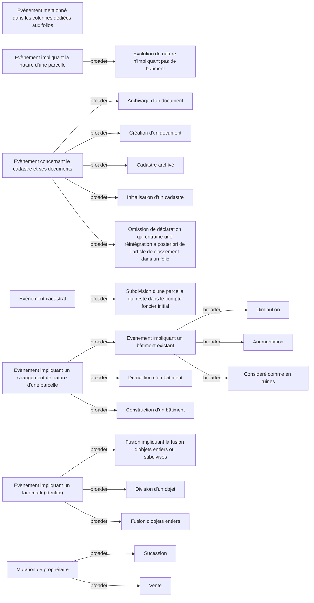

## Taxonomy
### Type of events
* URI : ```https://w3id.org/tabulae#LandRegistryEventList```

```mermaid
graph LR
    %% Déclaration de TOUS les concepts (y compris isolés)
    Addition["Augmentation"]
    CadastreCreation["Initialisation d'un cadastre"]
    CadastreOutdated["Cadastre archivé"]
    ChangeWithoutConstruction["Evolution de nature n'impliquant pas de bâtiment"]
    ConsideredAsRuined["Considéré comme en ruines"]
    Construction["Construction d'un bâtiment"]
    Demotion["Démolition d'un bâtiment"]
    Split["Division d'un objet"]
    SplitWithStay["Subdivision d'une parcelle qui reste dans le compte foncier initial"]
    DocumentCreation["Création d'un document"]
    DocumentOutdated["Archivage d'un document"]
    EventMentionnedinFoliosColumns["Evènement mentionné dans les colonnes dédiées aux folios"]
    Merge["Fusion d'objets entiers"]
    Omission["Omission de déclaration qui entraine une réintégration a posteriori de l'article de classement dans un folio"]
    PartialMerge["Fusion impliquant la fusion d'objets entiers ou subdivisés"]
    Reduction["Diminution"]
    Sale["Vente"]
    Sucession["Sucession"]
    PlotNatureEvent["Evènement impliquant la nature d'une parcelle"]
    TaxpayerMutation["Mutation de propriétaire"]
    BuiltPlotEvent["Evènement impliquant un bâtiment existant"]
    LandmarkEvent["Evènement impliquant un landmark (identité)"]
    CadastreAdminEvent["Evènement concernant le cadastre et ses documents"]
    PlotNatureChange["Evènement impliquant un changement de nature d'une parcelle"]
    CadastralEvent["Evènement cadastral"]

    %% Déclaration des relations
    PlotNatureChange -->|broader| BuiltPlotEvent
    CadastreAdminEvent -->|broader| DocumentOutdated
    PlotNatureChange -->|broader| Demotion
    BuiltPlotEvent -->|broader| Reduction
    TaxpayerMutation -->|broader| Sucession
    LandmarkEvent -->|broader| PartialMerge
    CadastreAdminEvent -->|broader| DocumentCreation
    CadastreAdminEvent -->|broader| CadastreOutdated
    PlotNatureEvent -->|broader| ChangeWithoutConstruction
    BuiltPlotEvent -->|broader| Addition
    PlotNatureChange -->|broader| Construction
    BuiltPlotEvent -->|broader| ConsideredAsRuined
    LandmarkEvent -->|broader| Split
    LandmarkEvent -->|broader| Merge
    TaxpayerMutation -->|broader| Sale
    CadastralEvent -->|broader| SplitWithStay
    CadastreAdminEvent -->|broader| CadastreCreation
    CadastreAdminEvent -->|broader| Omission
```