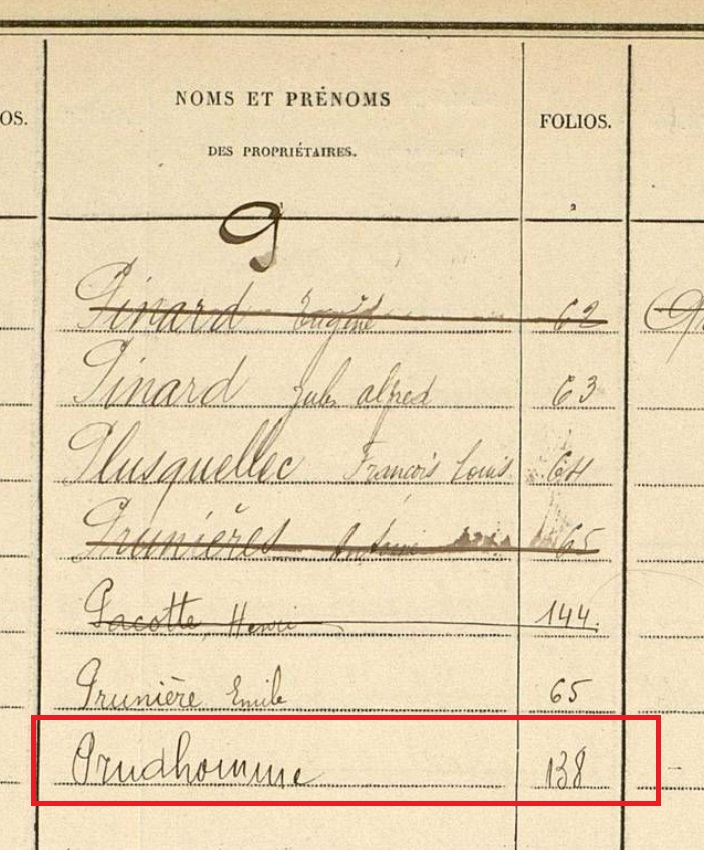
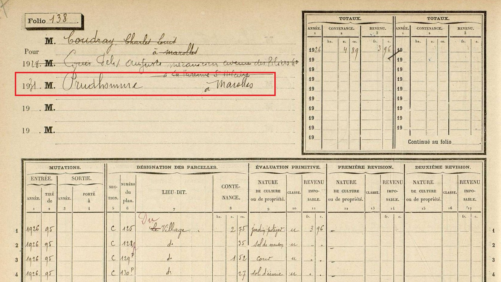
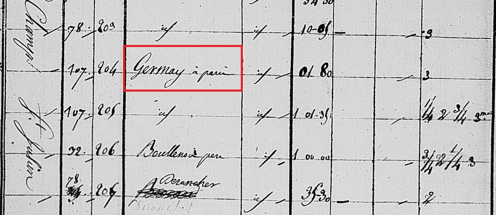
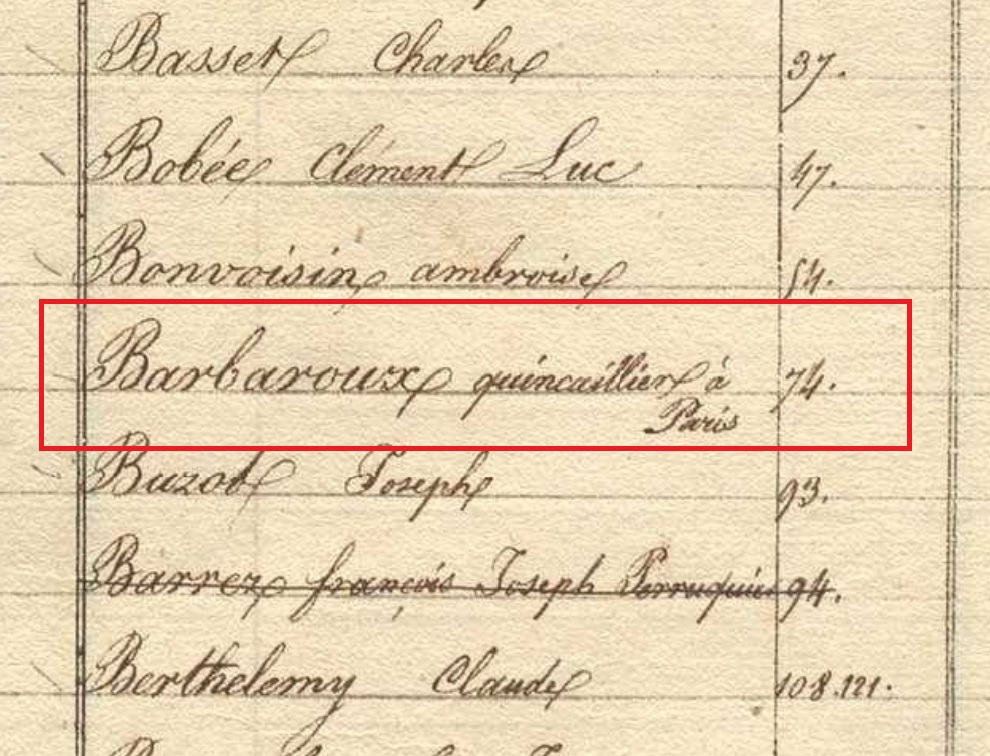
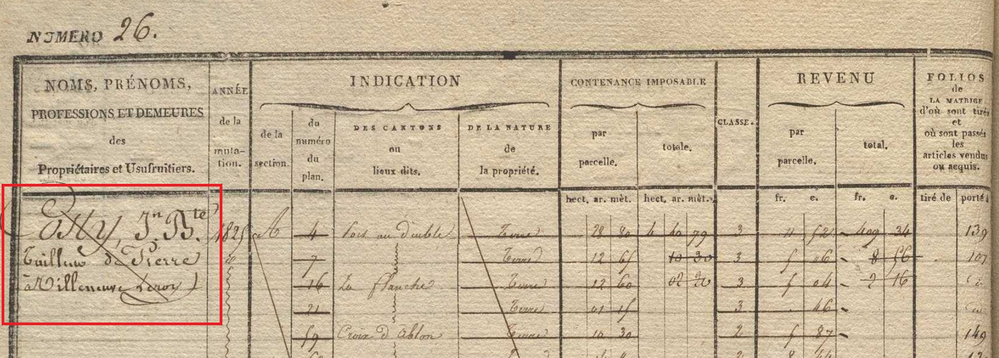
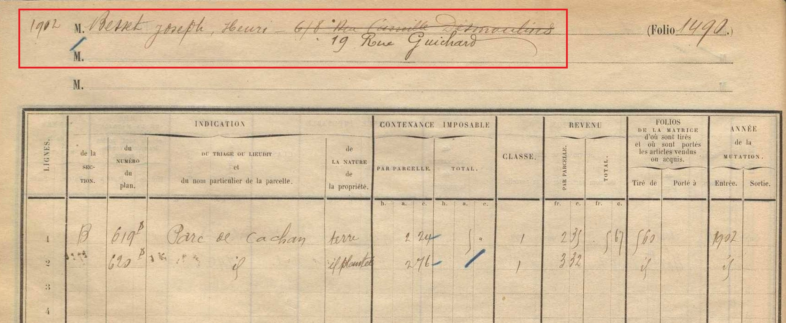
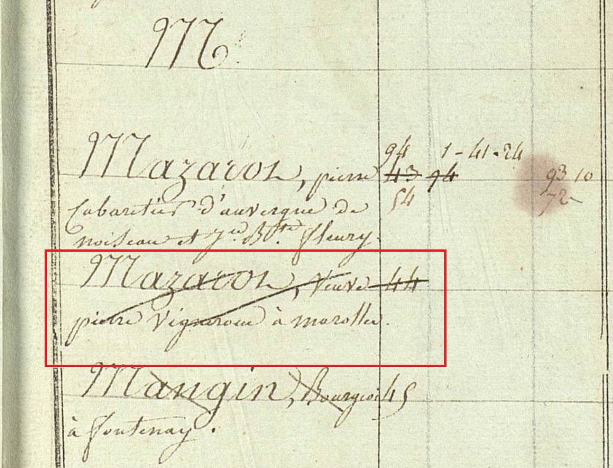
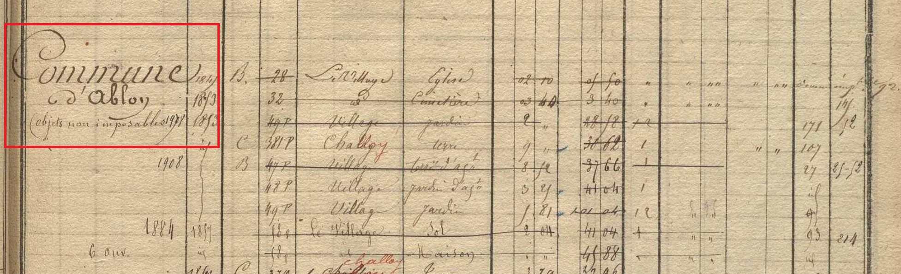
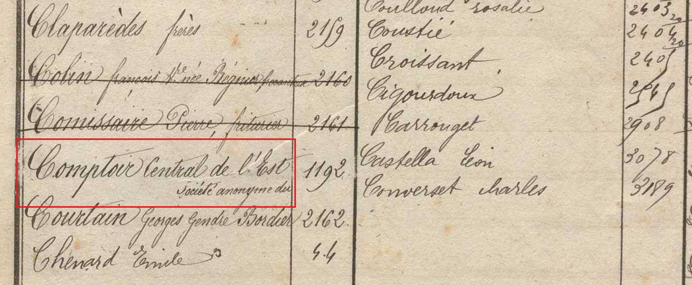

# Scénario de motivation du modelet Contribuables

## Nom

Contribuables

## Description

Le cadastre ancien a été établi en 1807 pour définir précisement et équitablement l'alivrement de chaque parcelle. Le cadastre ne permet pas de certifier la propriété d'une parcelle par une personne, seuls les actes notariés le peuvent. 

><i>Le véritable intérêt qu'a le Gouvernement au cadastre, c'est que par-tout la vérité soit connue , c'est que toutes les propriétés soient évaluées dans une juste proportion. Cet intérêt se fonde sur deux considérations : l'une, que plus l'impôt est également réparti, plus il se perçoit avec facilité ; l'autre , bien plus puissante à ses yeux, que l'égalité de la répartition est un grand acte de justice qu'il devait à tous les Français. Ainsi l'intérêt du Gouvernement n'est autre que celui des propriétaires eux-mêmes.</i> 
>>Extrait du <i>Recueil méthodique des lois, décrets, réglmens, instructions et décisions sur le cadastre de la France</i>, 1811

Les **contribuables** (propriétaires ou usufruitiers) des parcelles sont indiqués dans les registres du cadastre (états de sections et matrices). Il peut s'agir de personnes physiques ou morales, imposables pour les parcelles pour lesquelles elles possèdent le droit de propriété et/ou l'usufruit et sont donc généralement redevables de la contribution foncière.

Remarque : Certains propriétaires et usufruitiers mentionnés dans les matrices et états de sections ne sont pas imposables (exemple : les communes, l'Etat, le Génie militaire).

- Un **contribuable** est caractérisé par :
    - {*obligatoire*} un **libellé**
    - {*optionnel*} une **activité**
    - {*optionnel*} une ou plusieurs **adresses**
    - {*optionnel*} un **type de contribuable foncier** (Propriétaire,Nu-propriétaire,Usufruitier)

- La propriété **libellé** peut être décomposée en plusieurs autres propriétés :
    - {*obligatoire*} un **nom** ou une **raison sociale** ou une **expression référentielle** pour désigner un groupe de personnes (*Héritiers + Nom de famille*,*Veuve et enfants...*)
    - {*optionnel*} un ou plusieurs **prénoms**
    - {*optionnel*} un **titre** (*Monsieur,Madame,Mademoiselle,Monseigneur,Général*)
    - {*optionnel*} un **statut familial** (*Demoiselle, Veuve, Père, Fils, Fille, Mineur*)

Dans les registres d'états de sections, chaque parcelle listée est associée à un contribuable dans la ligne de tableau qui la décrit. 
Dans les matrices cadastrales, les états/mentions des parcelles (aussi appelés articles de classement) sont regroupés par contribuable (dans la grande majorité des communes).

Un contribuable peut succéder à un autre contribuable dans un même compte foncier, par exemple en cas de succession (probable).

## Exemples

### Exemple 1 [Nom]

<i>Prudhomme</i>  - Liste alphabétique de la matrice des propriétés non bâties de Marolles-en-Brie (Seine-et-Oise). 1914-1932. <a href="https://archives.valdemarne.fr/ark:71138/1f0791c5313468b087640050568bd3de.fiche=arko_fiche_689de19296a97.moteur=arko_default_6363c10d3b88b">Cote FRAD094_3P_000390_01_0012</a>.

### Exemple 2.1 [Nom | Adresse]

<i>Pruhomme à Marolles</i>  - Folio 138, Matrice des propriétés non bâties de Marolles-en-Brie (Seine-et-Oise). 1914-1932. <a href="https://archives.valdemarne.fr/ark:71138/1f0791c5479669b49ec30050568bd3de.fiche=arko_fiche_689de19296a97.moteur=arko_default_6363c10d3b88b">Cote FRAD094_3P_000390_01_00156</a>.

### Exemple 2.2 [Nom | Adresse]

<i>Germay à Paris</i>  - Etats de sections de la commune de Valenton (Seine-et-Oise). 1810-1811. Cote <a href="https://archives.valdemarne.fr/ark:71138/s005ba810f94cf3d/5ba810f95ed0a.fiche=arko_fiche_6363bde047036.moteur=arko_default_6363c10d3b88b">FRAD094_3P_000036_01_0015</a>.

### Exemple 3 [Nom | Activité | Adresse]

<i>Barbaroux quincailler à Paris</i>  - Liste alpahbétique de la matrice des propriétés foncières de Choisy-le-Roi (Seine). 1836-1841. Cote <a href = "https://archives.valdemarne.fr/ark:71138/1f07916c13996ba6b7f70050568bd3de.fiche=arko_fiche_689de15be441f.moteur=arko_default_6363c10d3b88b">FRAD094_3P_000171_01_0008</a>.

### Exemple 4 [Nom | Prénom | Activité | Adresse]
<i>Costy, Jn Bte Tailleur de Pierre à Villeneuve Leroy</i>  - Matrice des propriétés foncières d'Ablon-sur-Seine (Seine-et-Oise). 1822-1914. <a href="https://archives.valdemarne.fr/ark:71138/1f0791363aad6bb096190050568bd3de.fiche=arko_fiche_689de09e38671.moteur=arko_default_6363c10d3b88b">Cote FRAD094_3P_000019_01_0051</a>.

### Exemple 5 [Nom | Prénoms | Adresse 1 | Adresse 2 (à jour)]

<i>Besnet Joseph, Henri - <strike>6/8 Rue Camille Desmoulins</strike> 19 Rue Guichard</i>  - Matrice des propriétés non bâties de la commune d'Arcueil (Seine). 1902. Cote <a href="https://archives.valdemarne.fr/ark:71138/1f079142d0da61e0bd330050568bd3de.fiche=arko_fiche_689de15081b5f.moteur=arko_default_6363c10d3b88b">FRAD094_3P_000052_01_0004</a>.

### Exemple 6 [Nom | Prénom | Statut Familial | Adresse]

<i>Tellier Catherine fille majeure à Ablon</i>   - Etats de sections de la commune d'Ablon-sur-Seine (Seine-et-Oise). 1810. Cote FRAD094_3P_000017_01_0073.

### Exemple 7 [Nom | Statut familial |Prénom (du mari) |  Nom de naissance]

<i>Mazarot, Veuve Pierre vigneron à Marollese né Gerbuisson</i>  - Liste alphabétique de la matrice des propriétés bâties et non bâties de Marolles-en-Brie (Seine-et-Oise). 1812-1822. <a href="https://archives.valdemarne.fr/ark:71138/1f0791c510966f7c92da0050568bd3de.fiche=arko_fiche_689de19272b32.moteur=arko_default_6363c10d3b88b">Cote FRAD094_3P_000388_01_00050</a>.

### Exemple 8 [Raison sociale]

<i>Commune d'Ablon</i>  - Matrice des propriétés foncières d'Ablon-sur-Seine (Seine-et-Oise). 1822-1914. Cote <a href="https://archives.valdemarne.fr/ark:71138/1f0791363a9a684e99a40050568bd3de.fiche=arko_fiche_689de09e38671.moteur=arko_default_6363c10d3b88b">FRAD094_3P_000019_01_0050</a>.

### Exemple 9 [Raison sociale]

<i>Société anonyme du Comptoir Central de l'Est</i>  - Liste alphabétique de la matrice des propriétés foncières de Champigny (Seine-et-Oise). 1841-1914. <a href="https://archives.valdemarne.fr/ark:71138/1f079153003d6120b63f0050568bd3de.fiche=arko_fiche_689de155e8f50.moteur=arko_default_6363c10d3b88b">Cote FRAD094_3P_000107_01_0009</a>.

