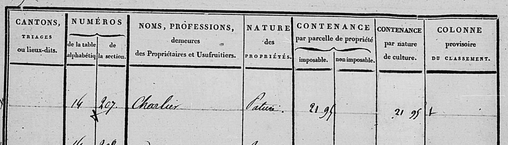
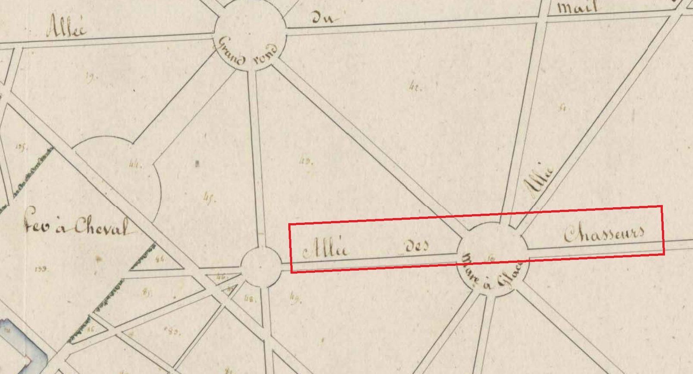
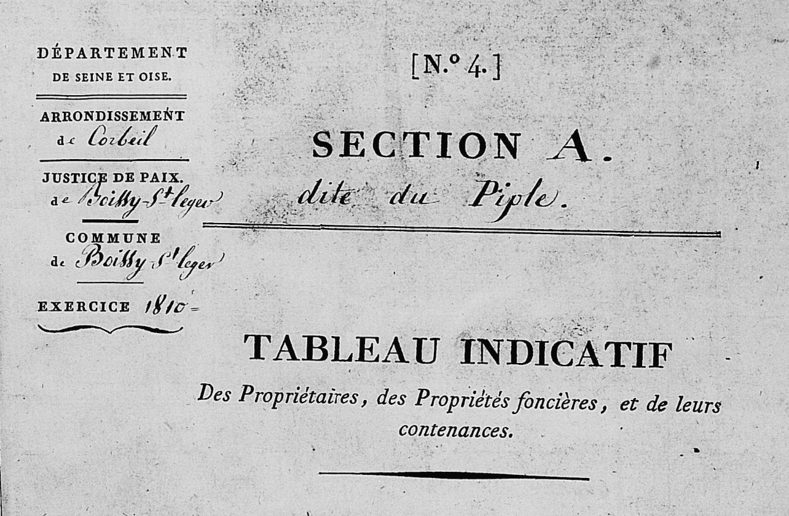

# Scénario de motivation du modelet Entités géographiques

## Nom
Entités géographiques

## Description

La **parcelle** est l'**entité géographique** élémentaire utilisée pour définir le montant de l'allivrement (impôt foncier). Elle est caractérisée par son **identifiant** (section+numéro), sa **nature**, son ou ses **contribuables** associés (conjoints ou sucessifs), sa localisation/son adresse dans la commune, sa contenance et ses revenus.

Une parcelle est localisée dans une section cadastrale. La numérotation des parcelles était réalisée par section.
La **section** se trouve elle-même dans une commune. Cette commune est rattachée aux différentes **circonscriptions administratives/électorales françaises** : cantons, arrondissements et départements. 
La production du cadastre était sous la responsabilité des départements.

Pour faciliter la localisation d'une parcelle dans une section, la parcelle était associée à une **adresse** : lieu-dit, voie ou à un autre type de point de repère.

Les parcelles et les objets du domaine non cadastrés - tels que les routes ou les cours d'eau - constituent les deux unités géographiques élémentaires qui permettent de recouvrir l'intégralité du territoire.

Une **entité géographique** est caractérisée par:
- {*obligatoire*} son **nom** ou son **libellé**
- {*obligatoire*} son **type** (parcelle, section, circonscription administrative, objet du domaine non cadastré...)
- {*obligatoire*} son **adresse** / sa **localisation** (correspond à des entités géographiques liées par une relation spatiale)
- {parcelle, section:*obligatoire*} son **identifiant cadastral** (parcelle: lettre de la section et numéro de parcelle ; section: lettre)
- {parcelle: *obligatoire*} sa **nature de sol**
- {parcelle: *obligatoire*} son/ses **propriétaire(s) ou usufruitiers**
- {*optionnel*} sa **géométrie**

## Exemples

### Exemple 1 [Parcelle]
<ul>
    <li>Numéro : A-207</li>
    <li>Type : Parcelle</li>
    <li>Localisation : Section A, Commune de Boissy-Saint-Léger</li>
    <li>Adresse : Le Village</li>
    <li>Propriétaire : Charlier</li>
    <li>Nature : Pâture</li>
</ul>
 - <a href="https://archives.valdemarne.fr/ark:71138/s005b9bb13d5a621/5b9bb13d6b508.fiche=arko_fiche_6363bdb8af050.moteur=arko_default_6363c10d3b88b">Cote FRA094_3P_000065_01_0030</a>, Etats de sections de Boissy-Saint-Léger, 1810

 

 ### Exemple 2 [Objet du domaine non cadastré]
<ul>
    <li>Nom : Allée des Chasseurs</li>
    <li>Type : route</li>
    <li>Localisation : Section C, Commune de Boissy-Saint-Léger</li>
</ul>
 - <a href="https://archives.valdemarne.fr/ark:71138/s005b9bb295ebae2/5b9bb295eca23.fiche=arko_fiche_6363bdbb1c511.moteur=arko_default_6363c10d3b88b">Cote FRA094_3P_000853</a>, Plan parcellaire de la section  de Boissy-Saint-Léger, 1810

### Exemple 3 [Section]
<ul>
    <li>Identifiant (lettre) : A</li>
    <li>Nom : Section A dite du Piple</li>
    <li>Type : Section cadastrale</li>
    <li>Localisation : Commune de Boissy-Saint-Léger, Justice de Paix de Boissy-Saint-Léger, Arrondissement de Corbeil, Département de Seine-et-Oise</li>
</ul>
 - <a href="https://archives.valdemarne.fr/ark:71138/s005b9bb13d5a621/5b9bb13d5c67f.fiche=arko_fiche_6363bdb8af050.moteur=arko_default_6363c10d3b88b">Cote FRA094_3P_000065_01_0001</a>, d'après la page de couverture, Etats de sections de Boissy-Saint-Léger, 1810

### Exemple 4 [Commune]
<ul>
    <li>Nom : Boissy-Saint-Léger</li>
    <li>Type : Commune</li>
    <li>Localisation : Justice de Paix de Boissy-Saint-Léger, Arrondissement de Corbeil, Département de Seine-et-Oise</li>
</ul>
 - <a href="https://archives.valdemarne.fr/ark:71138/s005b9bb13d5a621/5b9bb13d5c67f.fiche=arko_fiche_6363bdb8af050.moteur=arko_default_6363c10d3b88b">Cote FRA094_3P_000065_01_0001</a>, d'après la page de couverture, Etats de sections de Boissy-Saint-Léger, 1810 (<i>cf. image précédente</i>)