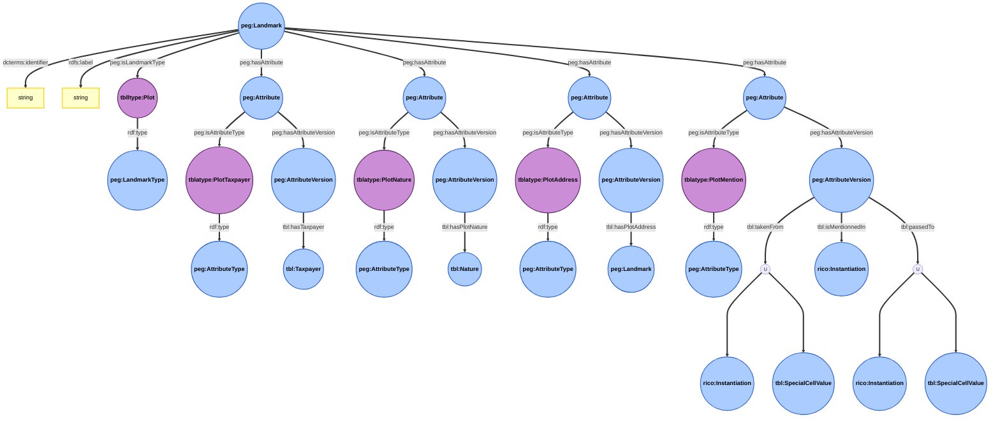
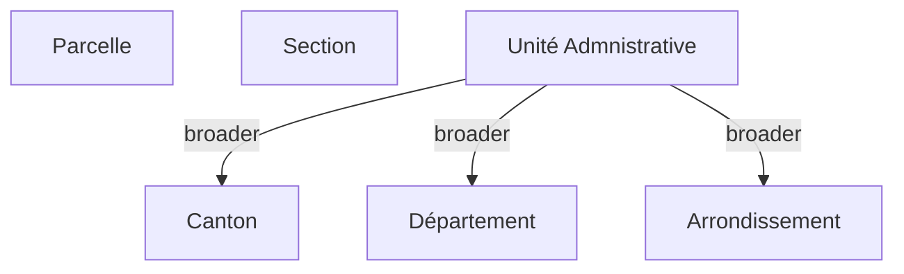
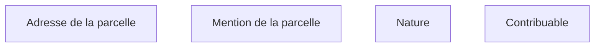

# Documentation illustrée du modelet Entités géographiques cadastrales

Cette page présente une représentation illustrée du modelet « Entités géographiques » de l'ontologie TABULAE. Il s'agit également d'une extension du sous-module ```Adresses``` de l'ontologie PeGazUs. Veuillez vous reporter à cette seconde ontologie pour obtenir le détail du modulet.

## Ontologie
### Représentation d'une parcelle
Classes et propriétés associées à un repère géographique (```peg:Landmark```) de type parcelle (```tblltype:Plot```).


#### Légende du schéma
* Les classes sont représentées par des cercles bleus.
* Les instances de classes issues de SKOS Concept schemes sont représentées par des cercles mauves.
* Les valeurs littérales sont représentées par des rectangles oranges.

### Remarques
* ```rdfs:label``` peut être utilisé pour renseigner un label complet, lisible de la parcelle, comprenant l'identifiant de la parcelle, de la section et le nom de la commune (ex : C-119, Section C, Marolles-en-Brie).
* ```dcterms:identifier``` est utilisé pour fournir l'identifiant complet de la parcelle (ex : C-119). 
* De nombreuses instances de la classe ```tbl:Nature``` sont définies dans le schémas de concepts SKOS ```tbl:NatureList```.
* De nombreuses instances de la classe ```tbl:SpecialCellValue``` sont définies dans le schéma de concepts SKOS ```tbl:SpecialCellValuesList```.
* L'attribut ```tblatype:PlotMention``` est lié au modelet "Fonctionnement des documents cadatsraux". Il permet (1) de représenter les valeurs spéciales que l'on trouve dans les colonnes "Tiré de" et "Porté à" (reports de folios et indications de construction, destruction de bâtiments ou encore de réévaluations de parcelles).

### Relations spatiales entre les entités géographiques cadastrales

```mermaid
graph
    PlotTypeNode(("tblltype:Plot<br><small>a peg:LandmarkType</small>"))
    SectionTypeNode(("tblltype:Section<br><small>a peg:LandmarkType</small>"))
    CommuneTypeNode(("tblltype:Commune<br><small>a peg:LandmarkType</small>"))
    CantonTypeNode(("tblltype:Canton<br><small>a peg:LandmarkType</small>"))
    ArrondissementTypeNode(("tblltype:Arrondissement<br><small>a peg:LandmarkType</small>"))
    DepartementTypeNode(("tblltype:Departement<br><small>a peg:LandmarkType</small>"))

    PlotNode["Plot<br><small>a peg:Landmark</small>"]
    SectionNode["Section<br><small>a peg:Landmark</small>"]
    CommuneNode["Commune<br><small>a peg:Landmark</small>"]
    CantonNode["Canton<br><small>a peg:Landmark</small>"]
    ArrondissementNode["Arrondissement<br><small>a peg:Landmark</small>"]
    DepartementNode["Département<br><small>a peg:Landmark</small>"]

    LRPlotSection["LR1<br><small>a peg:Landmark<br>Relation</small>"]
    LRSectionCommune["LR2<br><small>a peg:Landmark<br>Relation</small>"]
    LRCommuneCanton["LR3<br><small>a peg:Landmark<br>Relation</small>"]
    LRCantonArrondissement["LR4<br><small>a peg:Landmark<br>Relation</small>"]
    LRArrondissementDepartement["LR5<br><small>a peg:Landmark<br>Relation</small>"]

    LRType(("lrtype:Within<br><small>a peg:Landmark<br>RelationType</small>"))

    PlotNode == peg:isLandmarkType ==> PlotTypeNode
    SectionNode == peg:isLandmarkType ==> SectionTypeNode
    CommuneNode == peg:isLandmarkType ==> CommuneTypeNode
    CantonNode == peg:isLandmarkType ==> CantonTypeNode
    ArrondissementNode == peg:isLandmarkType ==> ArrondissementTypeNode
    DepartementNode == peg:isLandmarkType ==> DepartementTypeNode

    PlotNode == peg:locatum ==> LRPlotSection
    SectionNode == peg:relatum ==> LRPlotSection

    SectionNode == peg:locatum ==> LRSectionCommune
    CommuneNode == peg:relatum ==> LRSectionCommune

    CommuneNode == peg:locatum ==> LRCommuneCanton
    CantonNode == peg:relatum ==> LRCommuneCanton

    CantonNode == peg:locatum ==> LRCantonArrondissement
    ArrondissementNode == peg:relatum ==> LRCantonArrondissement

    ArrondissementNode == peg:locatum ==> LRArrondissementDepartement
    DepartementNode == peg:relatum ==> LRArrondissementDepartement

    LRPlotSection == peg:isLandmarkRelationType ==> LRType
    LRSectionCommune == peg:isLandmarkRelationType ==> LRType
    LRCommuneCanton == peg:isLandmarkRelationType ==> LRType
    LRCantonArrondissement == peg:isLandmarkRelationType ==> LRType
    LRArrondissementDepartement == peg:isLandmarkRelationType ==> LRType
    
    %% Style
    classDef vowlClassInstance fill:#CB8DD6,stroke:#5F2569,stroke-width:2px,color:#000,font-weight:bold;
    class PlotTypeNode,SectionTypeNode,CommuneTypeNode,CantonTypeNode,ArrondissementTypeNode,DepartementTypeNode,LRType, vowlClassInstance;

    classDef vowlInstance fill:#ece0f8,stroke:#d397d3,stroke-width:2px,color:#000;
    class PlotNode,SectionNode,CommuneNode,CantonNode,ArrondissementNode,DepartementNode,LRPlotSection,LRSectionCommune,LRCommuneCanton,LRCantonArrondissement,LRArrondissementDepartement vowlInstance;

```


#### Légende du schéma
* Les instances de classes issues de SKOS Concept schemes sont représentées par des cercles mauves.
* Les autres instances de classes sont représentées par des rectangles mauves.

## Taxonomies
### Types d'entités géographiques
* URI : ```https://w3id.org/tabulae#LandRegistryLandmarkList```

### Types d'attributs des parcelles
* URI : ```https://w3id.org/tabulae#LandRegistryAttributeList```

### Natures de parcelles
* URI : ```https://w3id.org/tabulae#NatureList```

```mermaid
graph LR
    %% Déclaration des concepts uniques
    Abreuvoir["Abreuvoir"]
    NatureNonBatie["Type de nature non bâtie"]
    Abricotier["Plantation d'abricotiers"]
    Plantation["Plantation"]
    Acacia["Plantation d'acacias"]
    Ajonc["Ajonc"]
    Allee["Allée"]
    Amandier["Plantation d'amandiers"]
    Appenti["Appenti"]
    NatureBatie["Type de nature bâtie"]
    Batiment["Bâtiment"]
    Ardoisiere["Ardoisière"]
    Carriere["Carrière"]
    Argilliere["Argillière"]
    Asperges["Plantation d'asperges"]
    Atelier["Atelier"]
    Aulnaie["Aulnaie"]
    Barraque["Baraque"]
    Bassin["Bassin"]
    BatimentRural["Bâtiment rural"]
    Batterie["Batterie"]
    Bief["Bief"]
    BoisAgrement["Bois d'agrément"]
    ObjetDAgrement["Objet d'agrément"]
    Bois["Bois"]
    Broussaille["Brousaille"]
    Bruyere["Bruyère"]
    Buissiere["Buissières"]
    CanalAgrement["Canal d'agrément"]
    Canal["Canal"]
    Cassis["Plantation de cassis"]
    Cedratiers["Plantation de cédratier"]
    Cerisaies["Cerisaies"]
    Chantier["Chantier"]
    Charmille["Charmille"]
    Chataigneraie["Châtaigneraies"]
    Chemin["Chemin"]
    ChemindeFer["Chemin de fer"]
    Cheneviere["Chenevière"]
    Cimetiere["Cimetiere"]
    Citronnier["Plantation de citronnier"]
    Clos["Clos"]
    CourCommune["Cour commune"]
    Cour["Cour"]
    CoursDEau["Cours d'eau"]
    Courtil["Courtil"]
    Jardin["Jardin"]
    Crayere["Crayère"]
    Cressonniere["Cressonnière"]
    Cuisine["Cuisine"]
    Dependance["Dépendance"]
    Digue["Digue"]
    Douve["Douve"]
    Dune["Dune"]
    Eau["Eau"]
    Ecluse["Ecluse"]
    Ecurie["Ecurie"]
    Eglise["Eglise"]
    EtablissementDeBains["Etablissement de bains"]
    EtangEmpoissonne["Etang empoissonné"]
    Etang["Etang"]
    Falaise["Falaise"]
    Figuier["Plantation de figuiers"]
    Fleur["Fleurs"]
    Fontaine["Fontaine"]
    Fosse["Fossé"]
    Fougeraie["Fougeraie"]
    Fraisier["Fraisiers"]
    Framboisier["Framboisiers"]
    Friche["Friche"]
    Genet["Genêt"]
    Graviere["Gravière"]
    Groseillier["Groseillier"]
    Gue["Gué"]
    Hangar["Hangar"]
    Herbage["Herbage"]
    Houblonniere["Houblonnière"]
    JardinDAgrement["Jardin d'agrément"]
    JardinMaraicher["Jardin Maraîcher"]
    Potager["Potager"]
    JardinMarais["Jardin Marais"]
    Jonc["Jonc"]
    Lac["Lac"]
    Lagune["Lagune"]
    Lande["Lande"]
    Lavande["Lavande"]
    Lavoir["Lavoir"]
    MachineAVapeur["Machine à vapeur"]
    Magasin["Magasin"]
    Maison["Maison"]
    Manufacture["Manufacture"]
    Fabrique["Fabrique"]
    MaraisSalant["Marais salant"]
    Mare["Mare"]
    Marecage["Marécage"]
    Marniere["Manière"]
    Meloniere["Melonière"]
    Mine["Mine"]
    Miniere["Minière"]
    MoulinAEau["Moulin à eau"]
    Moulin["Moulin"]
    MoulinAVent["Moulin à vent"]
    Murier["Plantation de mûriers"]
    Noisetier["Plantation de noisetiers"]
    Noyer["Plantation de noyers"]
    Olivier["Plantation d'oliviers"]
    Oranger["Plantation d'orangers"]
    Ormaie["Ormaie"]
    Oseraie["Oseraie"]
    Parterre["Parterre"]
    Passage["Passage"]
    Pecher["Plantation de pêchers"]
    Pepiniere["Pépinière"]
    Peuplier["Peuplier"]
    PieceDEauAgrement["Pièce d'eau d'agrément"]
    PieceDEau["Pièce d'eau"]
    Pin["Pin"]
    Plage["Plage"]
    Platriere["Plâtrière"]
    Poirier["Plantation de poiriers"]
    Verger["Verger"]
    Pommeraie["Pommeraie"]
    Poudriere["Poudrière"]
    Pre["Pre"]
    PrePlante["Pré planté"]
    Reservoir["Réservoir"]
    Rigole["Rigole"]
    Riziere["Rizière"]
    Rocher["Rocher"]
    Rosier["Rosier"]
    Routoir["Routoir"]
    Ruine["Ruine"]
    Sabliere["Sablière"]
    Salin["Salin"]
    Sapin["Sapin"]
    Saulaie["Saulaie"]
    Serre["Serre"]
    Sol["Sol"]
    Terrain["Terrain"]
    TerrainABatir["Terrain à bâtir"]
    TerrainDAgregemnt["Terrain d'agrément"]
    Terre["Terre"]
    TerreAVigne["Terre à vigne"]
    TerreLabourable["Terre labourable"]
    TerrePlantee["Terre plantée"]
    TerreVaine["Terre vaine"]
    Tourbiere["Tourbière"]
    Truffiere["Truffière"]
    Vigne["Vigne"]
    Vivier["Vivier"]
    Etendoir["Etendoir"]
    Sechoir["Séchoir"]
    Four["Four"]
    Fournil["Fournil"]
    Marais["Marais"]
    Palus["Palus"]
    Patis["Pâtis"]
    Paturage["Pâturage"]
    Pature["Pâture"]

    %% Déclaration des relations
    Patis -.->|closeMatch| Pature
    Argilliere -.->|closeMatch| Carriere
    NatureNonBatie -->|broader| TerreLabourable
    NatureBatie -->|broader| EtablissementDeBains
    PieceDEau -->|broader| PieceDEauAgrement
    NatureBatie -->|broader| Cuisine
    NatureNonBatie -->|broader| Bois
    Plantation -->|broader| Olivier
    NatureNonBatie -->|broader| Meloniere
    NatureNonBatie -->|broader| Rosier
    Batiment -->|broader| Poudriere
    NatureNonBatie -->|broader| Reservoir
    Palus -.->|closeMatch| Marais
    NatureNonBatie -->|broader| Bassin
    NatureNonBatie -->|broader| Chantier
    Batiment -->|broader| Batterie
    NatureBatie -->|broader| Cimetiere
    NatureNonBatie -->|broader| Rocher
    Ardoisiere -.->|closeMatch| Carriere
    Plantation -->|broader| Pommeraie
    NatureBatie -->|broader| Eglise
    NatureNonBatie -->|broader| TerreAVigne
    NatureNonBatie -->|broader| Jardin
    NatureNonBatie -->|broader| Palus
    Batiment -->|broader| BatimentRural
    Pature -.->|closeMatch| Paturage
    ObjetDAgrement -->|broader| CanalAgrement
    Pommeraie -.->|closeMatch| Verger
    ObjetDAgrement -->|broader| TerrainDAgregemnt
    NatureBatie -->|broader| Lavoir
    NatureNonBatie -->|broader| TerrainABatir
    JardinMaraicher -.->|exactMatch| Potager
    NatureNonBatie -->|broader| Carriere
    Plantation -->|broader| Groseillier
    NatureNonBatie -->|broader| Ormaie
    Cour -->|broader| CourCommune
    NatureNonBatie -->|broader| Chataigneraie
    NatureNonBatie -->|broader| Allee
    Plantation -->|broader| Abricotier
    NatureNonBatie -->|broader| Courtil
    NatureNonBatie -->|broader| Graviere
    NatureNonBatie -->|broader| Salin
    Plantation -->|broader| Acacia
    NatureNonBatie -->|broader| Lande
    NatureNonBatie -->|broader| Fontaine
    NatureNonBatie -->|broader| Saulaie
    Magasin -.->|closeMatch| Batiment
    NatureNonBatie -->|broader| Aulnaie
    Fournil -.->|closeMatch| Four
    NatureNonBatie -->|broader| Digue
    NatureNonBatie -->|broader| Broussaille
    NatureNonBatie -->|broader| Ardoisiere
    NatureNonBatie -->|broader| Buissiere
    NatureNonBatie -->|broader| Friche
    NatureNonBatie -->|broader| Fraisier
    NatureBatie -->|broader| Barraque
    Plantation -->|broader| Amandier
    NatureNonBatie -->|broader| Chemin
    ObjetDAgrement -->|broader| BoisAgrement
    NatureNonBatie -->|broader| TerreVaine
    NatureNonBatie -->|broader| Passage
    NatureNonBatie -->|broader| Platriere
    NatureNonBatie -->|broader| Vigne
    NatureNonBatie -->|broader| Sabliere
    Paturage -.->|closeMatch| Patis
    NatureNonBatie -->|broader| Crayere
    NatureBatie -->|broader| Ecurie
    Etang -->|broader| EtangEmpoissonne
    Plantation -->|broader| Figuier
    NatureNonBatie -->|broader| Patis
    Batiment -->|broader| Ruine
    NatureBatie -->|broader| Atelier
    ObjetDAgrement -->|broader| PieceDEauAgrement
    Four -.->|closeMatch| Fournil
    NatureNonBatie -->|broader| Cheneviere
    NatureNonBatie -->|broader| CoursDEau
    Moulin -->|broader| MoulinAVent
    NatureNonBatie -->|broader| Plantation
    NatureNonBatie -->|broader| Argilliere
    NatureNonBatie -->|broader| TerrePlantee
    Plantation -->|broader| Oranger
    Hangar -.->|closeMatch| Batiment
    NatureBatie -->|broader| Fournil
    Plantation -->|broader| Citronnier
    Plantation -->|broader| Murier
    NatureNonBatie -->|broader| Eau
    Bois -->|broader| BoisAgrement
    NatureNonBatie -->|broader| Lac
    NatureNonBatie -->|broader| Peuplier
    NatureNonBatie -->|broader| Miniere
    NatureBatie -->|broader| Etendoir
    Sechoir -.->|closeMatch| Etendoir
    Jardin -->|broader| JardinMaraicher
    NatureNonBatie -->|broader| Vivier
    NatureNonBatie -->|broader| Plage
    NatureNonBatie -->|broader| Etang
    NatureBatie -->|broader| Manufacture
    NatureBatie -->|broader| Fabrique
    NatureNonBatie -->|broader| Abreuvoir
    NatureNonBatie -->|broader| Falaise
    NatureNonBatie -->|broader| Douve
    NatureBatie -->|broader| Sechoir
    NatureNonBatie -->|broader| Pin
    NatureNonBatie -->|broader| Fosse
    Etendoir -.->|closeMatch| Sechoir
    NatureNonBatie -->|broader| Verger
    Moulin -->|broader| MoulinAEau
    NatureNonBatie -->|broader| Ecluse
    NatureNonBatie -->|broader| Lavande
    NatureNonBatie -->|broader| Mine
    NatureNonBatie -->|broader| Charmille
    NatureBatie -->|broader| Serre
    Marais -.->|closeMatch| Palus
    Canal -->|broader| CanalAgrement
    ObjetDAgrement -->|broader| JardinDAgrement
    Plantation -->|broader| Poirier
    NatureNonBatie -->|broader| Lagune
    Plantation -->|broader| Cerisaies
    NatureNonBatie -->|broader| Genet
    NatureNonBatie -->|broader| Pature
    NatureNonBatie -->|broader| Riziere
    Jardin -->|broader| Potager
    Poirier -.->|closeMatch| Verger
    NatureBatie -->|broader| Appenti
    NatureNonBatie -->|broader| Bruyere
    NatureBatie -->|broader| Cour
    TerrePlantee -.->|closeMatch| Plantation
    Plantation -.->|closeMatch| TerrePlantee
    Paturage -.->|closeMatch| Pature
    NatureNonBatie -->|broader| Clos
    Manufacture -.->|closeMatch| Fabrique
    NatureNonBatie -->|broader| Canal
    NatureNonBatie -->|broader| Gue
    NatureNonBatie -->|broader| Oseraie
    NatureNonBatie -->|broader| Pepiniere
    NatureNonBatie -->|broader| Terre
    NatureNonBatie -->|broader| Sapin
    NatureNonBatie -->|broader| Truffiere
    NatureNonBatie -->|broader| Cressonniere
    Dependance -.->|closeMatch| Batiment
    NatureBatie -->|broader| Dependance
    NatureNonBatie -->|broader| MaraisSalant
    Plantation -->|broader| Pecher
    Plantation -->|broader| Fleur
    NatureNonBatie -->|broader| Herbage
    NatureBatie -->|broader| MachineAVapeur
    NatureNonBatie -->|broader| Marecage
    NatureNonBatie -->|broader| ChemindeFer
    Plantation -->|broader| Cedratiers
    Barraque -.->|closeMatch| Batiment
    NatureNonBatie -->|broader| Parterre
    CanalAgrement -.->|closeMatch| Canal
    Pature -.->|closeMatch| Patis
    NatureNonBatie -->|broader| Framboisier
    NatureNonBatie -->|broader| Jonc
    NatureNonBatie -->|broader| PrePlante
    Courtil -.->|closeMatch| Jardin
    NatureBatie -->|broader| Batiment
    NatureBatie -->|broader| Maison
    Patis -.->|closeMatch| Paturage
    NatureNonBatie -->|broader| TerrainDAgregemnt
    NatureNonBatie -->|broader| Terrain
    NatureNonBatie -->|broader| Marniere
    NatureNonBatie -->|broader| PieceDEau
    NatureNonBatie -->|broader| Mare
    NatureNonBatie -->|broader| Tourbiere
    Appenti -.->|closeMatch| Batiment
    JardinMaraicher -.->|closeMatch| Plantation
    BoisAgrement -.->|closeMatch| Bois
    NatureNonBatie -->|broader| Ajonc
    NatureNonBatie -->|broader| Fougeraie
    NatureBatie -->|broader| Moulin
    NatureNonBatie -->|broader| Dune
    Jardin -->|broader| JardinDAgrement
    NatureNonBatie -->|broader| Sol
    NatureNonBatie -->|broader| Marais
    Plantation -->|broader| Cassis
    Plantation -->|broader| Noisetier
    NatureNonBatie -->|broader| Pre
    NatureBatie -->|broader| Hangar
    NatureNonBatie -->|broader| Bief
    NatureNonBatie -->|broader| Paturage
    NatureNonBatie -->|broader| Rigole
    Jardin -->|broader| JardinMarais
    NatureBatie -->|broader| Magasin
    Plantation -->|broader| Asperges
    NatureBatie -->|broader| Four
    Plantation -->|broader| Noyer
    NatureNonBatie -->|broader| Routoir
    NatureNonBatie -->|broader| Houblonniere
```
