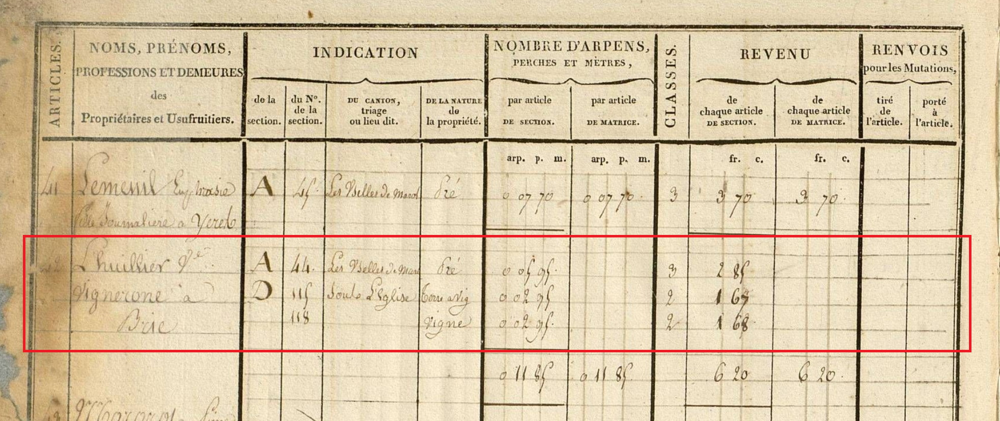
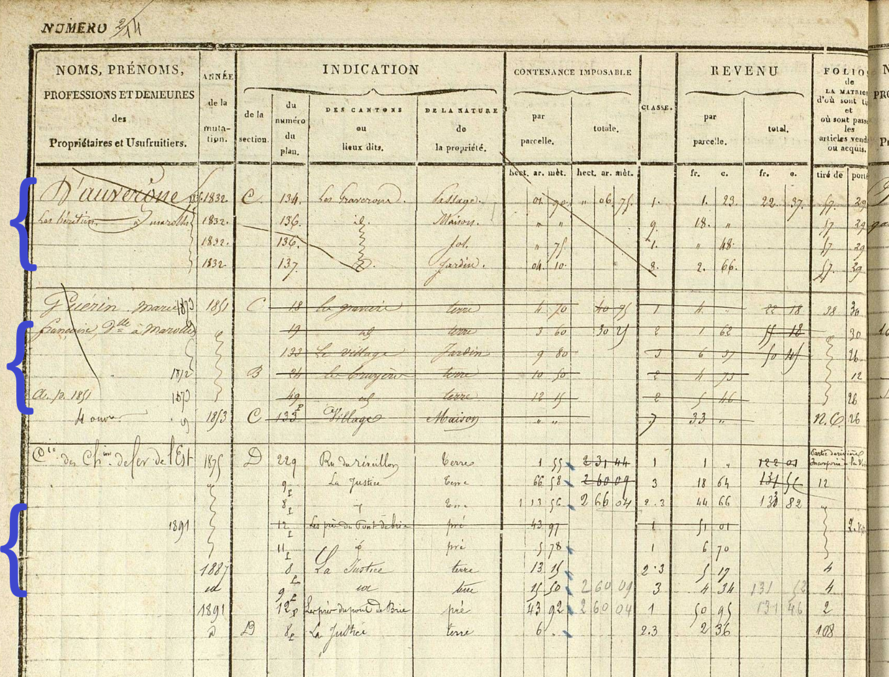

# Scénario de motivation Documentation cadastrale

## Nom

Fonctionnement et organisation des documents cadastraux

## Description

### Documents

Le cadastre ancien est composé d'un ensemble documentaire créé et complété selon des règles définies. Ce modelet s'attache à décrire la documentation cadastrale non pas en tant que source mais en tant qu'objet administratif dont le fonctionnement peut s'apparenter à celui d'une base de données manuscrite. Les modelets **Sources** et **Documentation cadastrale** sont intrinsèquement liés.

Les registres qui composent la documentation cadastrale sont les états de sections et les matrices.

Les **états de sections** sont composés de chapitres. Chaque chapitre débute par une page de couverture qui décrit la section considérée (département, arrondissement, canton, commune, nom de la section, identifiant) et d'un tableau où chaque ligne correspond à l'état initial d'une parcelle à la création du cadastre. 
Dans des registres créés avant 1822, il est également possible de trouver des chapitres dédiés à l'imposition des propriétés bâties.
Pour assembler les données contenues dans les états de sections: 
- il faut tenir compte de l'ordre des pages "Couvertures" puis "Tableau" afin de construire l'identifiant des parcelles (Lettre de la section - Numéro de la parcelle).
- le tableau peut contenir une colonne qui indique l'identifiant d'un contribuable dans la matrice. Ce numéro peut éventuellement être utilisé comme un champ de jointure soit avec les numéros de folio soit avec l'index du contribuable dans la table alphabétique de la matrice.
- en pratique, c'est souvent le nom du contribubale dans l'état de sections qui permet de retrouver son folio dans la matrice qui le suit chronologiquement.

Les **matrices cadastrales** contiennent un ensemble de tableaux dont la structure varie au cours du temps. Appelés "article", "**folio**" ou "case", les pages de tableaux principaux associent un numéro à un ou plusieurs ensembles composés d'une liste de propriétaires et d'une liste états de parcelles qui lui sont associés. Nous appelons une association d'une liste de contribuables sucessifs et de leurs parcelles un **compte foncier**. 
D'après le *Recueil de 1810*, les deux parties composant un compte foncier :
- la liste des propriétaires successifs qui lui sont associés, appelé "**article de mutation**" dans le <i>Recueil de 1811</i> :
- les états des parcelles détenues par ce(s) propriétaire(s), appelés "**articles de classement**" dans le <i>Recueil de 1811</i> :
Si plusieurs comptes fonciers se trouve dans le même folio, ils partagent le même numéro.

Un **compte foncier** est ainsi la liste des parcelles appartenant à un ou plusieurs contribuables sucessifs.
Un même contribuable peut être cité à plusieurs comptes fonciers contenus dans des folios différents dans le cadastre d'une même commune :
- sucessivement, par exemple dans deux matrices qui se succèdent ;
- soit parallèlement, par exemple lors des périodes où une matrice est dédiée à la description des propriétés non bâties et une autre à la description des propriétés non bâties ;

### Fonctionnement

Dans chaque état de parcelle (ligne de matrice), il peut être indiqué le folio (ou l'état) dans lequel la parcelle se trouvait avant sa dernière modification (colonne "Tiré de") et celui dans lequel elle se trouve suite la modification suivante (colonne "Porté à"). 
Des états qui concernent les propriétés (principalement bâties) sont également indiqués **dans ces mêmes colonnes de façon indifférenciée** : "Nouvelle construction" (C.N/N.C), "Augmentation" (Aug), "Evaluation du bâti" (E.B.), "Destruction", "Ruine", etc.

**Les passages d'un folio à un autre sont des informations indispensables pour ordonner les différents états d'une même parcelle dans l'ordre chronologique ou déduire des fusions/divisions.**

Les lignes obsolètes d'un compte foncier sont généralement rayées. 
Un compte foncier clôt peut être entièrement barré, surtout si la clôture intervient avant l'archivage du registre. 

La **mise en page des dates varie fortement selon les types de registre** : 
- Dans les registres les plus anciens, il n'y avait pas de colonne pour les dates. Elles étaient indiquées entre deux articles ou au-dessus de l'en-tête de la page. Elles sont difficiles à repérer pour le lecteur qui doit parcourir les pages pour trouver l'information (quand elle existe). 
- Dans les registres produits à partir de 1820, on observe l'apparition d'une unique colonne pour les dates de début et de fin de validité. Les scripteurs utilisent souvent une colonne adjacent pour indiquer une seconde date.
- Dans les registres initialisés à partir du milieu du XIXème siècle, on observe deux colonnes pour les dates ("Date d'entrée" et "Date de sortie" du compte foncier).

## Exemples

### Exemple 1 [Folio 1..1 Compte foncier]
*La page contient plusieurs articles numérotés. Chaque article correspond à un compte foncier. Il n'y a pas de colonnes pour les dates.*

- **Numéro** : 42
- **Propriétaire** : Lhuillier Ve Vigneronne à Marolles
- **Dates de validité du compte foncier** : 1812-1822 (validité de la matrice faute de dates plus précises)
- **Liste des parcelles mentionnées** :
    - A-44
    - D-115
    - D-118
- **Matrice** : Matrice de rôles [propriétés bâties et non bâties] de Marolles-en-Brie (1812-1822)

### Exemple 2 [Folio 1..n Comptes fonciers]
*La page contient un folio numéroté qui contient 3 comptes fonciers différentes. Chaque article correspond à un compte foncier. Il y a une seule colonne pour les dates. Le scripteur a inscrit des dates supplémentaires dans la colonne dédiée aux ontribuables.*
- **Numéro** : 2 <i>ET</i> 14
- **Propriétaire**:
    - Compte foncier 1 : D'Auvergne les héritiers à Marolles
    - Compte foncier 2 : Guérin Marie Françoise delle [*Demoiselle*] à Marolles
    - Compte foncier 3 : Cie des Chmin de Fer de l'Est
- **Liste des parcelles mentionnées** :
    - Compte foncier 1 : C-134, C-136 (deux états), C-137
    - Compte foncier 2 : C-18, C-19, C-133 (deux états), B-24, B-49p
    - Compte foncier 3 : D-229, D-9p (deux états), D-8p (trois états), D-12p (deux états), D-11p, 
- **Matrice** : Matrice des propriétés foncières/non bâties (1822-1914), Marolles-en-Brie

