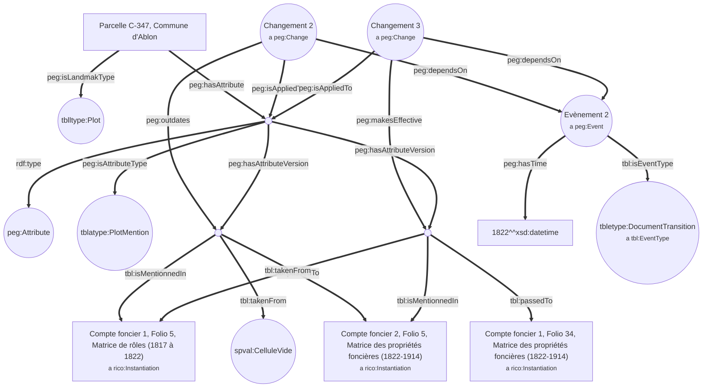
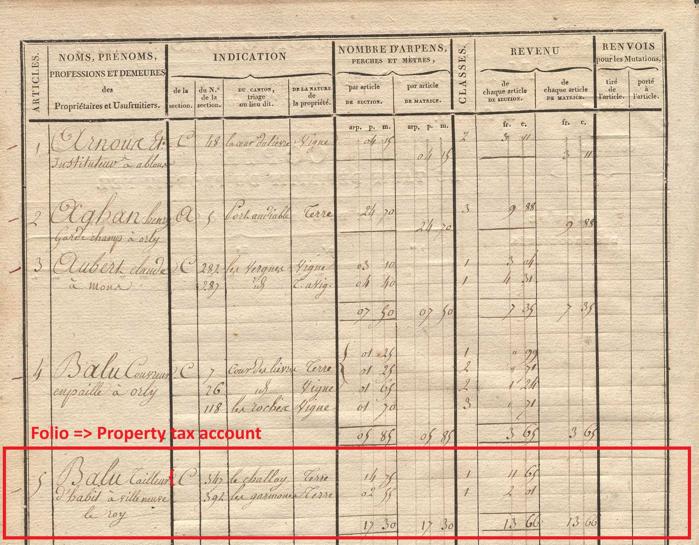
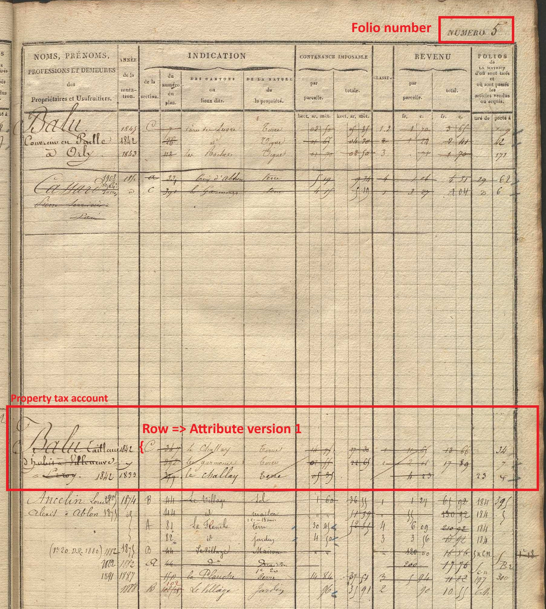
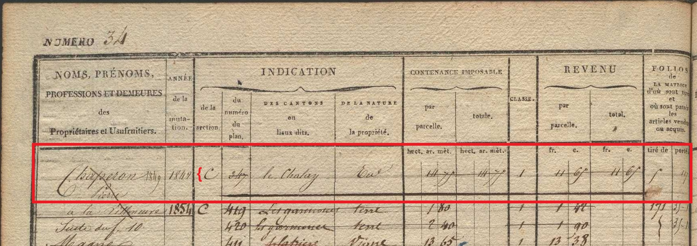
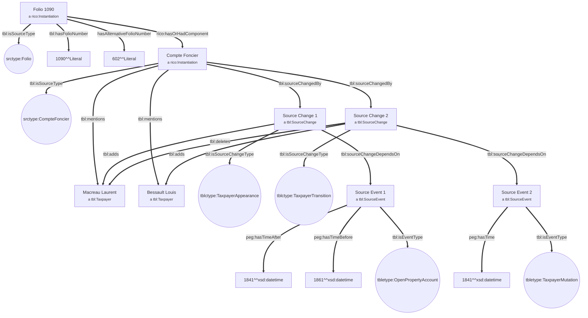
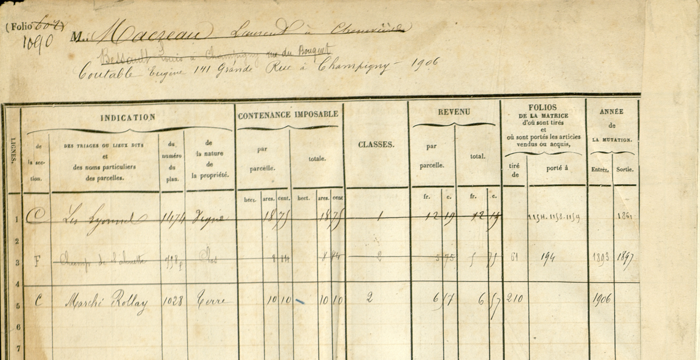

# Schéma représentants le modelet "Fonctionnement des documents cadastraux"

## 1. Mentions d'une parcelle dans des comptes fonciers
* Le schéma illustre les valeurs associées aux mentions précédentes, courantes et suivantes d'une parcelle dans un compte foncier. Des valeurs spéciales associées à une parcelle au fil du temps peuvent également apparaître.
* Si la cellule associée à la colonne "Tiré de" est vide, la valeur de la propriété ```tbl:takenFrom``` est ```spval:CelluleVide``` par défaut.
* Si la cellule associée à la colonne "Tiré de" est vide, la valeur de la propriété ```tbl:passedTo``` est ```spval:CelluleVide``` est vide par défaut. 
* Pour une représentation fine, complète, de la source, les comptes fonciers (sous-parties de folios qui sont eux-mêmes des sous-parties de pages), doivent avoir été reconnus. Dans le cas contraire, on peut associer des entités correspondant à des folios (```srctype:Folio```) aux propriétés ```tbl:takenFrom``` et  ```tbl:passedTo```.
* Dans cet exemple, on décrit un attribut **d'un objet de type ```peg:Landmark```** possédant un attribut spécifique (```tblatype:PlotMention```) qui permet de retracer son parcours dans les documents. Comme les autres attributs d'instances de ```peg:Landmark``` , ces éléments peuvent être associés à des changements (```peg:Change```) qui sont eux mêmes associés à des évènements (```peg:Event```).

*Pour des questions de lisibilité, seuls les changements entre les deux versions d'attributs sont représentés. Pour obtenir un graphe complet, il faut également représenter les changements liés à l'apparition de la première version d'attribut et à la disparition de la deuxième version d'attributs.*



#### Extraits de documents relatifs au schéma
* Version d'attribut n°1 : Compte foncier 1, Folio 5, Matrice de rôles (1817 à 1822)

* Version d'attribut n°2 : Compte foncier 2, Folio 5, Matrice des propriétés foncières (1822-1914)

* 3ème compte foncier dans lequel la parcelle est ajoutée (valeur indiquée par la propriété *tbl:passedTo* )


## 2. Contribuables dans les comptes fonciers
* Le premier exemple illustre les mentions d'une parcelle' dans des comptes fonciers sucessifs.
* Ce second exemple présente l'autre composante importante du fonctionnement des documents cadastraux : les mentions des contribuables dans les comptes fonciers.
* On ne traite pas ici de changements liés à des versions d'attributs de ```peg:Landmark```. Le concept ```peg:Change``` ne peut donc pas être utilisé (voir *domains* et *ranges* définis dans l'ontologie PeGazUs).
* L'ontologie TABULAE introduit le concept de ```tbl:SourceChange``` qui permet de représenter un changement directement lié à un document. Il dépend dans évènement de type ```tbl:SourceEvent``` qui est une sous-classe de ```peg:Event```.

*Pour des raisons de lisibilité, les changements 3  (disparition du 2ème contribuable/apparition du 3ème contribuable) et 4 (disparition du 3ème contribuable) ne sont pas affichés dans la figure.*



#### Exemple
