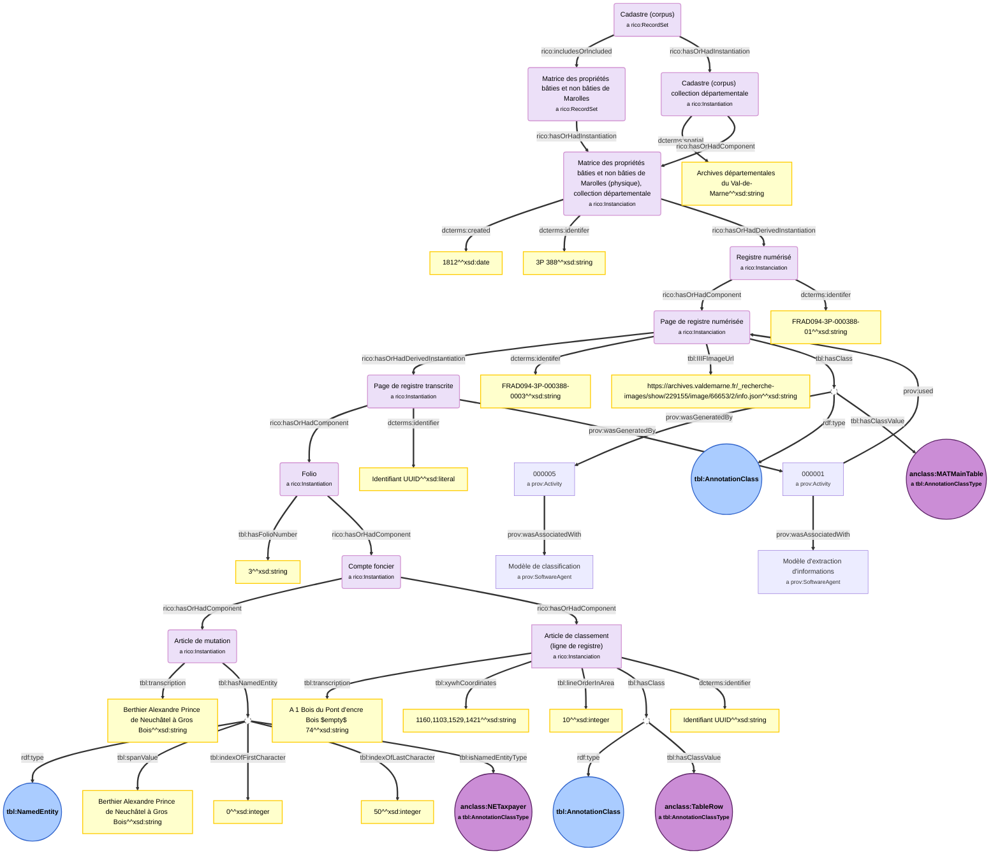
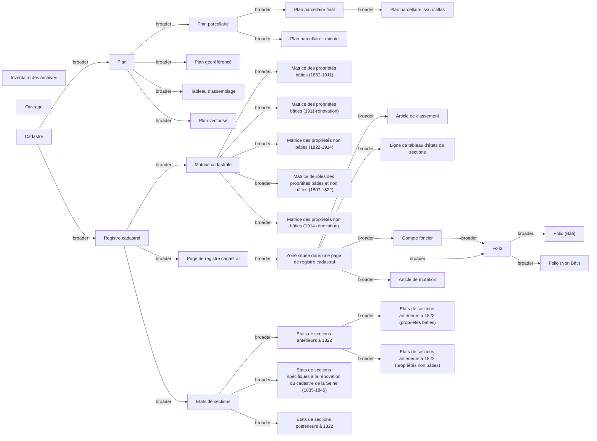

# Documentation illustrée du modelet Sources 

## Représentation des documents d'archives et de leurs versions dérivées

### Exemple d'une page de registre d'états de sections
Ce graphe illustre la représentation du corpus d'archives, d'une page dans celui-ci et d'un extrait de résultat d'extraction brute de son contenu.
*Le résultat complet de l'étape de reconnaissance des entités nommées dans la transcription complète de la ligne n'est pas représenté ici pur des raisons de lisibilité. Seul l'exemple de l'entité nommée de type contribuable est proposé.*

```mermaid
graph 
    %% 1. Nodes
    LRConceptNode("Cadastre (corpus)<br><small>a rico:RecordSet</small>")
    LRInstantiationNode("Cadastre (corpus) édition départementale<br><small>a rico:Instantiation</small>")

    RegisterConceptNode("Registre d'état de section de Marolles<br><small>a rico:RecordSet</small>")
    PhysicalRegisterNode("Registre d'état de sections (physique), édition départementale<br><small>a rico:Instanciation</small>")
    ArchLocationLit["Archives départementales du Val-de-Marne"^^xsd:string]
    PubDate["1810"^^xsd:date]
    ArchivalReferenceLit["3P 387"^^xsd:string]
    DigitisedRegisterNode("Registre numérisé<br><small>a rico:Instanciation</small>")
    DigArchivalReferenceLit["FRAD094-3P-000387-01"^^xsd:string]

    ImageNode("Page de registre numérisée<br><small>a rico:Instanciation</small>")
    RefImageNode["FRAD094-3P-000387-0001"^^xsd:string]
    AnnotationClassInstBN((" "))
    tblAnnotationClass((tbl:AnnotationClass))
    SKOSPageClass(("anclass:ETSTab<br><small>a "))
    TreatedImageNode("Page de registre transcrite"<br><small>a rico:Instantiation</small>)
    TreatedImageNodeUUID["Identifiant UUID"^^xsd:literal]

    ClassificationActivity["000001<br><small>a prov:Activity</small>"]
    SoftwareAgentYolo["Modèle de classification<br><small>a prov:SoftwareAgent"]
    TranscriptionActivity01["000002<br><small>a prov:Activity</small>"]
    SoftwareAgentDAN["Modèle d'extraction d'informations<br><small>a prov:SoftwareAgent"]
    %%NERActivity["000003<br><small>a prov:Activity</small>"]
    %%SoftwareAgentCamembert["NER<br><small>a prov:SoftwareAgent"]

    RowNode("Ligne de registre<br><small> a rico:Instanciation</small>")
    LiteralFullRow["Les uselles de Marolles 60 Berthier Alexandre Prince de Neufchâtel Terre"^^xsd:string]
    IIIFImageUrlLiteral["https://archives.valdemarne.fr/_recherche-images/show/59414/image/38776/3/full/1024,/0/default.jpg"^^xsd:string]
    RowInteger[18^^xsd:integer]
    CoordsFullRow[1160,1103,1529,1421^^xsd:string]
    RowNodeClassBN((" "))
    RowNodeClass((tbl:AnnotationClass))
    RowNodeClassValue((anclass:TableRow))
    RowIdentifier["Identifiant UUID"^^xsd:string]

    NamedEntityBN((" "))
    tblNamedEntity(("tbl:NamedEntity"))
    LiteralText["Berthier Alexandre Prince de Neufchâtel"^^xsd:string]
    LiteralStartChar["26"^^xsd:integer]
    LiteralStopChar["64"^^xsd:integer]
    SKOSEntityType(("anclass:NETaxpayer"))

    %% 2. Edges
    LRConceptNode == rico:includesOrIncluded ==> RegisterConceptNode
    LRConceptNode == rico:hasOrHadInstantiation ==> LRInstantiationNode

    LRInstantiationNode == dcterms:spatial ==> ArchLocationLit 
    RegisterConceptNode == rico:hasOrHadInstantiation ==> PhysicalRegisterNode
    LRInstantiationNode == rico:hasOrHadComponent ==> PhysicalRegisterNode
    PhysicalRegisterNode == dcterms:created ==> PubDate
    PhysicalRegisterNode == dcterms:identifer ==> ArchivalReferenceLit
    PhysicalRegisterNode == rico:hasOrHadDerivedInstantiation ==> DigitisedRegisterNode
    DigitisedRegisterNode == rico:hasOrHadComponent ==> ImageNode
    DigitisedRegisterNode == dcterms:identifer ==> DigArchivalReferenceLit

    ImageNode == rico:hasOrHadDerivedInstantiation ==> TreatedImageNode 
    TreatedImageNode == rico:hasOrHadComponent ==> RowNode
    TreatedImageNode == dcterms:identifier ==> TreatedImageNodeUUID
    ImageNode  == dcterms:identifer ==> RefImageNode
    ImageNode  == tbl:IIIFImageUrl ==> IIIFImageUrlLiteral
    ImageNode  == tbl:hasClass ==> AnnotationClassInstBN
    AnnotationClassInstBN == prov:wasGeneratedBy ==> ClassificationActivity
    ClassificationActivity == prov:wasAssociatedWith ==> SoftwareAgentYolo
    TranscriptionActivity01 == prov:used ==> ImageNode
    TranscriptionActivity01 == prov:wasAssociatedWith ==> SoftwareAgentDAN
    TreatedImageNode == prov:wasGeneratedBy ==> TranscriptionActivity01
    AnnotationClassInstBN == rdf:type ==> tblAnnotationClass
    AnnotationClassInstBN == tbl:hasClassValue ==> SKOSPageClass
    
    RowNodeClassBN == rdf:type ==> RowNodeClass
    RowNode == tbl:transcription ==> LiteralFullRow
    RowNode == tbl:xywhCoordinates ==> CoordsFullRow
    RowNode == tbl:lineOrderInArea ==> RowInteger
    RowNode == tbl:hasNamedEntity ==> NamedEntityBN
    RowNode == tbl:hasClass ==> RowNodeClassBN
    RowNode == dcterms:identifier ==> RowIdentifier
    RowNodeClassBN == tbl:hasClassValue ==> RowNodeClassValue
    
    NamedEntityBN == rdf:type ==> tblNamedEntity
    NamedEntityBN == tbl:spanValue ==> LiteralText
    NamedEntityBN == tbl:indexOfFirstCharacter ==> LiteralStartChar
    NamedEntityBN == tbl:indexOfLastCharacter ==> LiteralStopChar
    NamedEntityBN == tbl:isNamedEntityType ==> SKOSEntityType
    %%NamedEntityBN == prov:wasGeneratedBy ==> NERActivity
    %%NERActivity == prov:used ==> RowNode
    %%NERActivity == prov:wasAssociatedWith ==> SoftwareAgentCamembert

    %% 3. Apply WebVOWL Style
    classDef vowlClass fill:#aaccff,stroke:#3366cc,stroke-width:2px,color:#000,font-weight:bold;
    classDef vowlLiteral fill:#ffffcc,stroke:#ffcc00,stroke-width:2px,color:#000;
    classDef vowlInstance fill:#ece0f8,stroke:#d397d3,stroke-width:2px,color:#000;
    classDef vowlValue fill:#ffffcc,stroke:#ffcc00,stroke-width:1px,color:#000,font-family:monospace;
    %% Skos
    classDef vowlClassInstance fill:#CB8DD6,stroke:#5F2569,stroke-width:2px,color:#000,font-weight:bold;
    %% Blank node
    classDef blankNode fill:#ffffff,stroke:#888888,stroke-width:2px,stroke-dasharray: 4;

    class LRConceptNode,LRInstantiationNode,RegisterConceptNode,PhysicalRegisterNode,DigitisedRegisterNode,ImageNode,TreatedImageNode,RowNode vowlInstance;

    class ArchLocationLit,PubDate,ArchivalReferenceLit,DigArchivalReferenceLit,RefImageNode,LiteralFullRow,IIIFImageUrlLiteral,RowInteger,CoordsFullRow,TreatedImageNodeUUID,LiteralText,LiteralStartChar,LiteralStopChar,RowIdentifier vowlLiteral;

    class AnnotationClassInstBN,NamedEntityBN,RowNodeClassBN blankNode;

    class tblAnnotationClass,tblNamedEntity,RowNodeClass vowlClass;

    class SKOSPageClass,SKOSEntityType,RowNodeClassValue vowlClassInstance;
```


##### Remarques
* ```prov:Activity``` possède des propriétés supplémentaires telles que des dates de débuts et de fins de processus, etc.
* ```prov:Agent``` et ```prov:SoftwareAgent``` possèdent également des propriétés supplémentaires (nom de l'agent, etc.).
* On préférera utilisé la classe ```rico:Instantiation``` pour décrire les documents utilisés plutôt que des ```rico:RecordResource```. Il existe (en théorie) deux exemplaires d'un même cadastre pour chaque commune (collection communale et collection départementale). Le contenu commun de ces deux collections n'a pas pu faire l'objet d'une comparaison qui permette d'instantier correctement et en détails des ```rico:RecordResource``` liant les éléments communs aux deux collections. En théorie, suivant l'ontologie Ric-O  :
    * Une instance de ```rico:Instantiation``` correspondant à une **page** peut également avoir une instance de ```rico:Record``` associée`.  
    *  Une instance de ```rico:Instantiation``` correspondant à un élément dans une page (ligne, compte foncier, folio, etc.) peut avoir un ```rico:RecordPart``` associé. 

### Exemple d'une page de matrice 
Comme dans l'exemple précédent concernant les états de sections, ce graphe illustre la représentation du corpus d'archives, d'une page dans celui-ci et d'un extrait de résultat d'extraction brute de son contenu.


### Notes
* Comme précédement, les instances de la classe ```rico:Instantitation``` pour les **folios** et les **comptes fonciers** ont théoriquement une instance de ```rico:RecordPart``` associées commune aux versions communales et départementales du cadastre de la commune traitée.
* Des instances de ```prov:Activity``` supplémentaires pourraient être ajoutées selon la chaîne de traitement utilisées pour traiter le corpus (ex : étape de NER supplémentaire pour segmenter les descriptions de contribuables).
* Dans ce schéma, nous n'avons pas représenté les  ```tbl:AnnotationClass``` associées aux instances de ```rico:Instantiation``` correspondant aux Folio, Compte foncier, Article de Mutation pour des questions de lisibilité. Elles en ont une en pratique, associée, entre autres, aux coordonnées des zones correspondantes dans l'image source. Un exemple est proposé pour l'instance de ```rico:Instantiation``` correspondant à une ligne de tableau/article de classement.
* L'instance de ```rico:Instantiation``` correspondant à une Ligne de tableau est associée en pratique à plusieurs ```tbl:NamedEntity``` non représentées pour des questions de lisibilité.

## Taxonomies
### Type des sources
* URI : ```https://w3id.org/tabulae#LandRegistrySourceList```


## Bibliographie
* Voir l'article suivant concernant l'utilisation de Prov-O pour représenter des documents, leurs versions dérivées et les processus de production de celles-ci:
```plaintext 
Melvin Hersent, Abadie Nathalie, Duménieu Bertrand, Perret Julien. Modèles et outils pour la publication de métadonnées d'archives géographiques et de leurs données dérivées. Humanistica 2023, Association francophone des humanités numériques, Jun 2023, Genève, Suisse. pp.hal-04110787. ⟨hal-04110787⟩
```